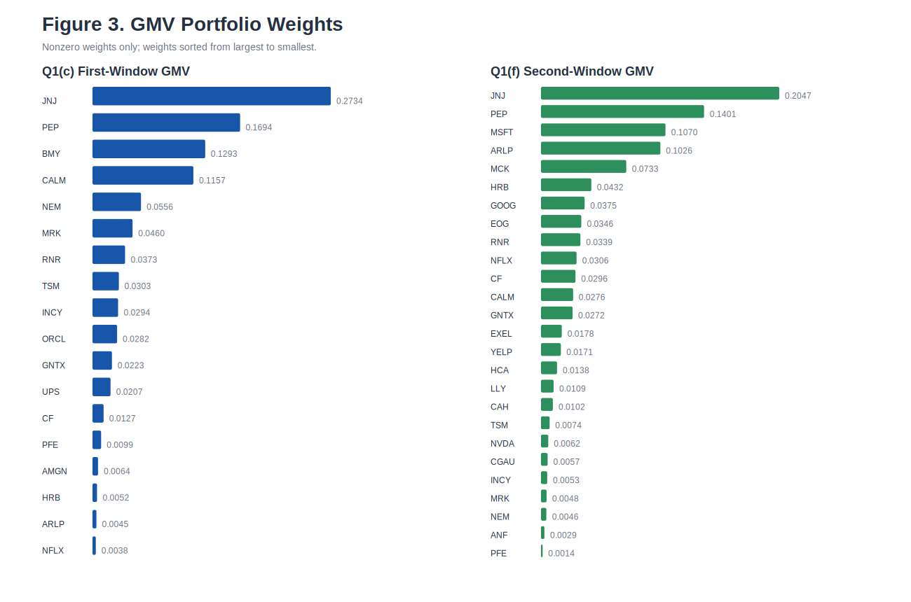
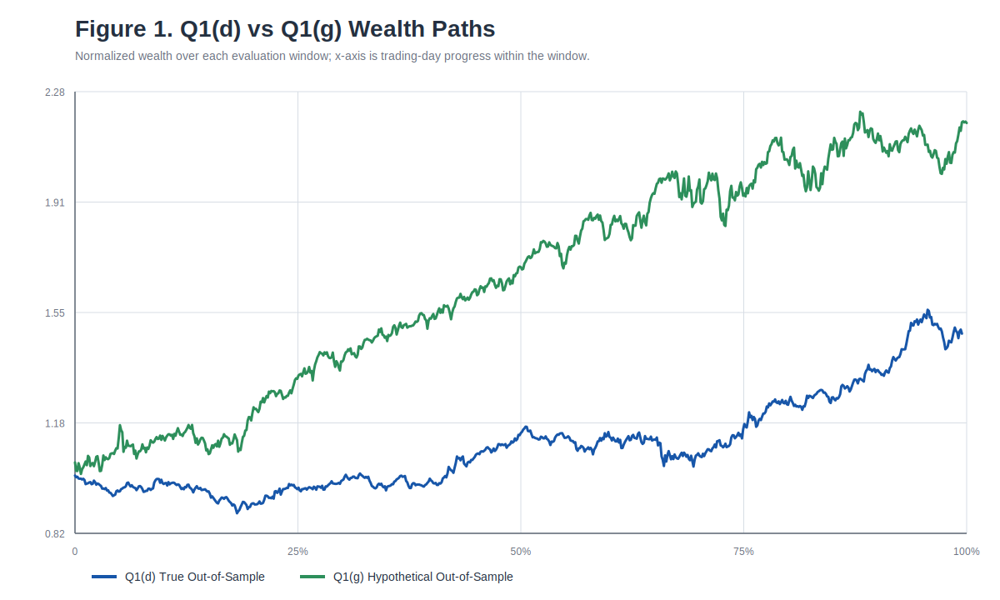
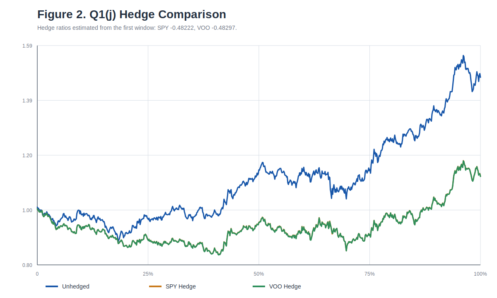
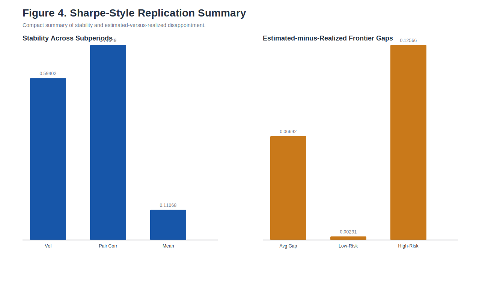

## Summary

- **Q1(a)** I use Tiingo as the primary data source for the 50 portfolio stocks plus SPY and VOO because it provides a reproducible API-based dataset with raw prices, adjusted prices, and explicit corporate-action fields. Relative to the Yahoo split-adjusted workbook, Tiingo provides a more consistent total-return framework for portfolio optimization and hedge analysis.
- **Q1(d)** Using the first three years to estimate the long-only global minimum-variance portfolio and the last three years for evaluation, the portfolio produces a cumulative return of 47.71862%, an annualized return of 13.85000%, an annualized volatility of 12.30208%, a Sharpe ratio of 1.12583, and a maximum drawdown of -12.38624%.
- **Q1(g)** Using the reverse estimation window, the hypothetical out-of-sample portfolio performs substantially better than the true forward out-of-sample portfolio, with cumulative return 117.47746%, annualized return 27.36607%, annualized volatility 16.86051%, Sharpe ratio 1.62309, and maximum drawdown -9.40742%, which indicates strong estimation-window sensitivity.
- **Q1(i)-(j)** The variance-minimizing hedge ratios are -0.48222 for SPY and -0.48297 for VOO. Both hedges reduce variance out of sample, with VOO slightly more effective, but neither improves overall risk-adjusted performance.
- **Q1(k)** In my Sharpe-style replication, volatility and pairwise correlations are substantially more stable across subperiods than mean returns. The estimated frontier also overstates realized performance, especially in the aggressive high-return region.
- **Q2** I do not agree that the optimal hedge ratio is generally $-\beta_Y/\beta_X$. The correct variance-minimizing hedge ratio is $\beta^\ast = -\frac{\beta_Y \beta_X \sigma_M^2}{\beta_X^2 \sigma_M^2 + \sigma_X^2}$, and the Monte Carlo experiment confirms this result.

Supporting exhibits are provided as Appendix A through Appendix G:
- Appendix A: Summary Metrics
- Appendix B: Q1(b) AMZN Return Example
- Appendix C: Q1(b)/(e) Parameter Summary
- Appendix D: Q1(c) Nonzero GMV Weights
- Appendix E: Q1(f) Nonzero GMV Weights
- Appendix F: Q1(j) Hedge Performance
- Appendix G: Q1(k) Sharpe Replication Summary
- Appendix H: Selected Code Snippets
- Appendix I: Extended Supporting Tables

I compared two candidate datasets for this assignment: my Tiingo end-of-day dataset and a Yahoo Finance spreadsheet containing daily prices for the same 50 stocks plus SPY and VOO. Both datasets broadly satisfy the coverage requirement, since both include the required securities and both reflect the fact that GEHC only has standalone history beginning in January 2023. However, the two datasets differ materially in structure, adjustment methodology, and suitability for return-based analysis.

The Yahoo workbook is essentially a consolidated price table. Its own description states that it contains “split-adjusted closes,” which means it is useful for handling stock splits, but it does not provide the broader corporate-action detail needed for a fully auditable return construction framework. By contrast, Tiingo provides a full end-of-day structure for each security, including raw OHLCV fields, adjusted OHLCV fields, and explicit corporate-action variables such as divCash and splitFactor. This makes Tiingo much more transparent and reproducible as a research dataset.

The most important difference is the adjustment convention. In the Yahoo workbook, prices for dividend-paying securities such as SPY, VOO, JNJ, and PEP match Tiingo’s raw closing prices much more closely than Tiingo’s adjusted closing prices. For example, on 2020-04-13, the Yahoo values for SPY, VOO, JNJ, and PEP are exactly the same as Tiingo’s raw close values, whereas Tiingo’s adjClose values are materially lower because they incorporate the effect of dividends over time. This implies that the Yahoo spreadsheet is split-adjusted, but not fully total-return adjusted in the same way as Tiingo’s adjusted-close series.

This distinction matters economically. Over 2020-04-13 to 2026-04-07, SPY returns 139.14240% in the Yahoo series but 160.24540% using Tiingo adjusted close; VOO returns 139.36170% versus 161.40080%; JNJ returns 70.57310% versus 101.70640%; and PEP returns 17.05250% versus 40.80690%. The gap is small for AMZN because AMZN is mainly affected by stock splits rather than recurring cash dividends. Therefore, the Yahoo workbook would understate total-return performance for dividend-paying securities and would lead to a less consistent return series for portfolio optimization and hedge evaluation.

For these reasons, Tiingo is the stronger primary data source for this homework. It is not only an API-based and reproducible source, but also a more complete one: it preserves raw prices, provides fully adjusted prices, and records corporate actions explicitly. Relative to the Yahoo split-adjusted workbook, this gives Tiingo a clear advantage in adjustment consistency, auditability, and defensibility for Markowitz estimation, out-of-sample testing, and hedge analysis.

References：
- [Tiingo API token help](https://www.tiingo.com/kb/article/where-to-find-your-tiingo-api-token/)
- [Tiingo EOD data workflow](https://www.tiingo.com/kb/article/the-fastest-method-to-ingest-tiingo-end-of-day-stock-api-data/)
- [Yahoo Help: adjusted close includes splits and dividends](https://help.yahoo.com/kb/SLN28256.html)
- [Yahoo Help: historical data download availability](https://help.yahoo.com/kb/index?id=SLN2311&locale=en_US&page=content&y=PROD_FIN)

## Data and Implementation Notes

- The six-year sample is divided into two three-year windows for estimation and evaluation.
- I use adjusted close data to construct returns.
- I use simple daily returns rather than log returns.
- GEHC is retained in the raw dataset for completeness but excluded from estimation, optimization, and Sharpe-style replication because it lacks a complete three-year estimation window.
- The optimization universe therefore contains 49 stocks.
- I use 252 trading days to annualize returns and volatility.
- The Sharpe ratio is reported without subtracting a risk-free rate.


1. **(Portfolio Construction, Single Period) For the “50 best value ideas” portfolio you constructed in the first half of the course (available in hw4.50StockValuePortfolio.xlsx):**

**(a) Identify and use any data source of your choice to download daily data for (i) the stocks in that portfolio and (ii) two broad market ETFs: the most widely traded S&P ETF, State Street’s SPDR S&P 500 ETF Trust (SPY), and Vanguard’s similar product, Vanguard S&P 500 ETF (VOO), for the past six years. Please make sure you detail the source of data you selected and the reasons for which you chose it.**


> For Question 1(a), I selected Tiingo's historical end-of-day API as the data source for the 50 portfolio stocks, as well as SPY and VOO. I chose Tiingo for several reasons. First, it is a token-authenticated and reproducible API-based source, which makes the data collection process transparent and easy to document. Second, it provides consistent daily data for both individual equities and broad-market ETFs, allowing us to use a single source for the entire sample. Third, Tiingo reports not only daily OHLCV data but also adjusted price fields and corporate-action information, which is important for computing returns and for ensuring consistency in later portfolio optimization and hedge analysis. Using one source for all securities also reduces the risk of mismatched dividend or split adjustments across data vendors. Finally, Tiingo is a free and practical source for this assignment while still offering a more formal and defensible setup than unofficial scraping-based alternatives.

> I did not use Yahoo Finance as my primary source even though Yahoo provides broad market coverage and adjusted historical price information. The main reason is that I wanted my data collection process to be easy to justify, document, and reproduce within a consistent API-based framework. In practice, many users access Yahoo data through third-party wrappers such as yfinance, which are convenient but are not official Yahoo APIs. By contrast, Tiingo offers a token-authenticated end-of-day API that is more straightforward to describe as a formal and reproducible data source. Since this assignment requires a six-year daily dataset for 50 stocks plus SPY and VOO, I preferred a single-source setup with clearly defined fields for daily prices, adjusted prices, and corporate actions. Yahoo Finance remains a useful backup source, but Tiingo was a better fit for the transparency and consistency required for this homework.

> One important exception is GEHC, whose standalone trading history begins only after the GE HealthCare spin-off, so it does not have a full six-year standalone price history. I therefore retain its actual post-spin-off history rather than splice in pre-separation GE prices.

> Another reason for choosing Tiingo is that it provides adjusted price fields and corporate-action information, which helps ensure that stock splits and dividend distributions are handled consistently across the sample.

For the remainder of the assignment, I retain GEHC in the downloaded raw dataset for completeness, but exclude it from the portfolio estimation, optimization, and Sharpe-style replication because it does not have a full estimation window.

**(b) Use the first three of the data in your dataset to estimate the necessary parameters for the Markowitz mean-variance portfolio construction framework (for the 50 stocks) in the value portfolio) we discussed in class.**

I use the first three years of the dataset as the estimation window for the Markowitz mean-variance framework. Since returns require two consecutive price observations, the return sample begins on the second trading day of the window and continues through the end of the first three-year period. The analysis is carried out for the stocks in the value portfolio rather than for SPY or VOO, following the GEHC treatment stated above.

I compute daily stock returns using adjusted closing prices. Let $P_{i,t}$ denote the adjusted closing price of stock $i$ on day $t$. Then the daily return for stock $i$ is calculated as $r_{i,t} = \frac{P_{i,t}}{P_{i,t-1}} - 1$. I use simple daily returns rather than log returns. I use adjusted prices rather than raw closing prices so that stock splits and dividend-related adjustments are handled consistently across securities.

Using these daily returns, I estimate the expected return vector and the covariance matrix required for the Markowitz framework. For each stock $i$, the sample mean return is $\hat{\mu}_i = \frac{1}{T}\sum_{t=1}^{T} r_{i,t}$, where $T$ is the number of trading days in the estimation window. Collecting these sample means across all stocks gives the estimated expected return vector $\hat{\mu}$. I then estimate the covariance matrix $\hat{\Sigma}$ using the sample covariance formula $\hat{\Sigma}_{ij} = \frac{1}{T-1}\sum_{t=1}^{T}(r_{i,t}-\hat{\mu}_i)(r_{j,t}-\hat{\mu}_j)$ for each pair of stocks $i$ and $j$. These two objects, $\hat{\mu}$ and $\hat{\Sigma}$, are the necessary inputs for the portfolio optimization in part (c).

For illustration, consider Amazon (AMZN). Its adjusted closing price was $108.44350$ on April 13, 2020 and $114.16600$ on April 14, 2020. Therefore, the daily return on April 14, 2020 is calculated as $r_t = \frac{114.16600}{108.44350} - 1 = 0.052767$, or about $5.27670\%$. On April 15, 2020, the adjusted closing price was $115.38400$, so the next daily return is $r_{t+1} = \frac{115.38400}{114.16600} - 1 = 0.010669$, or about $1.06690\%$. Repeating this calculation over the full estimation window gives the return series for AMZN, and the same procedure is then applied to all other stocks in the portfolio.

Table 1 below gives the concrete adjusted-price return example used in part (b). The full supporting exhibit is provided as Appendix B.

| Date | Adj Close | Return |
| --- | ---: | ---: |
| 2020-04-13 | 108.44350 |  |
| 2020-04-14 | 114.16600 | 0.05276941 |
| 2020-04-15 | 115.38400 | 0.01066868 |

Table 2 summarizes the estimation inputs for parts (b) and (e). The same information is provided in Appendix C.

| Window | Return Start | Return End | Stocks Used | Observations | Mean Vector Size | Covariance Matrix Size |
| --- | --- | --- | ---: | ---: | --- | --- |
| First 3 Years | 2020-04-14 | 2023-04-12 | 49 | 755 | 49x1 | 49x49 |
| Last 3 Years | 2023-04-13 | 2026-04-10 | 49 | 751 | 49x1 | 49x49 |

**(c) Use the parameters you estimated to construct the Markowitz optimal portfolio (of the 50 stocks) with the constraints we adopted in class of full investment, no leverage, and long-only positions) at the end of the first three years.**

I treat the problem as a single-period Markowitz portfolio optimization problem, consistent with the framework discussed in Lecture 9. Because the assignment specifies full investment, no leverage, and long-only positions, but does not specify a target return, I interpret the Markowitz optimal portfolio here as the long-only global minimum-variance portfolio under those constraints. More specifically, I construct the long-only global minimum-variance portfolio at the end of the first three-year estimation window. Using the covariance matrix $\hat{\Sigma}$ estimated in part (b), I choose the portfolio weights across the remaining stocks, following the GEHC treatment stated above.

Let $w = (w_1, w_2, \dots, w_N)^\top$ denote the portfolio weight vector, where $N$ is the number of stocks included in the optimization. The portfolio variance is

$$
\sigma_P^2 = w^\top \hat{\Sigma} w.
$$

Following the standard mean-variance setup from class, I solve the quadratic optimization problem

$$
\min_w \; w^\top \hat{\Sigma} w
$$

subject to

$$
\sum_{i=1}^{N} w_i = 1,
$$

$$
w_i \ge 0 \quad \text{for all } i.
$$

These constraints correspond to the conditions imposed in class. The condition $\sum_{i=1}^{N} w_i = 1$ enforces full investment, while $w_i \ge 0$ imposes long-only positions. Together, these constraints also imply no leverage. Under these constraints, the solution is the global minimum-variance portfolio.

In practice, the calculation proceeds as follows. First, I take the estimated daily covariance matrix $\hat{\Sigma}$ from part (b). Second, I define the decision variables as the portfolio weights $w_1, \dots, w_N$. Third, I use an optimizer to minimize $w^\top \hat{\Sigma} w$ subject to the portfolio constraints above. The solution gives the global minimum-variance portfolio weights at the end of the first three years. These weights are then carried forward into part (d), where I evaluate the portfolio’s out-of-sample performance over the remaining three years.

Table 3 reports the nonzero weights in the portfolio from part (c), sorted from largest to smallest. The full supporting exhibit is provided as Appendix D.

| Ticker | Weight |
| --- | ---: |
| JNJ | 0.27338465 |
| PEP | 0.16935349 |
| BMY | 0.12933417 |
| CALM | 0.11572998 |
| NEM | 0.05564359 |
| MRK | 0.04595794 |
| RNR | 0.03734833 |
| TSM | 0.03025001 |
| INCY | 0.02936160 |
| ORCL | 0.02822401 |
| GNTX | 0.02229923 |
| UPS | 0.02069483 |
| CF | 0.01273855 |
| PFE | 0.00987416 |
| AMGN | 0.00635839 |
| HRB | 0.00517130 |
| ARLP | 0.00448692 |
| NFLX | 0.00378885 |

The part (c) global minimum-variance portfolio assigns zero weight to 31 of the 49 stocks.

**(d) Evaluate the “out-of-sample” performance of the portfolio you constructed in step (c)) in the last three years of your dataset (“evaluate” means that you are to give all the relevant performance metrics that you consider important for this period).**

For part (d), I evaluate the out-of-sample performance of the portfolio constructed in part (c) over the last three years of the dataset. This period is treated as out of sample because it was not used in estimating the expected return vector or covariance matrix in part (b), and it was not used in determining the portfolio weights in part (c). Instead, the portfolio weights obtained at the end of the first three years are held fixed and then applied to the realized stock returns in the remaining three years.

Let $w^\ast$ denote the optimal portfolio weight vector obtained in part (c), and let $r_t$ denote the vector of realized daily stock returns in the last three years of the sample. The portfolio’s daily out-of-sample return is then

$$
r_{p,t} = (w^\ast)^\top r_t.
$$

Using this return series, I evaluate the portfolio’s performance with several relevant metrics. First, I compute the cumulative return over the out-of-sample period as

$$
\prod_{t=1}^{T}(1+r_{p,t}) - 1.
$$

Second, I compute the average daily return and annualize it as

$$
\bar r_{ann} = 252 \times \frac{1}{T}\sum_{t=1}^{T} r_{p,t}.
$$

Third, I compute the portfolio’s daily standard deviation and annualize it as

$$
\sigma_{ann} = \sqrt{252}\cdot \text{stdev}(r_{p,t}).
$$

Fourth, I compute the Sharpe ratio as a summary risk-adjusted performance measure. If the risk-free rate is ignored over this horizon, I use

$$
\text{Sharpe} = \frac{\bar r_{ann}}{\sigma_{ann}}.
$$

I also compute the portfolio’s maximum drawdown, which captures the largest peak-to-trough decline in cumulative portfolio value during the out-of-sample period. Together, these measures allow me to evaluate not only how much the portfolio earned, but also how much risk and downside volatility it experienced while doing so.

This out-of-sample evaluation is important because it provides a more realistic test of the portfolio construction framework. The portfolio in part (c) was built using only the first three years of data, so its performance in the last three years indicates how well that strategy holds up on data that were not used in model estimation or portfolio selection.

Using the last three years of the sample, the portfolio’s out-of-sample performance is as follows:

- number of daily return observations: 751
- cumulative return: 47.71862%
- annualized mean return: 13.85000%
- annualized volatility: 12.30208%
- Sharpe ratio: 1.12583
- maximum drawdown: -12.38624%
- CAGR: 13.98677%

**(e) Repeat step (b) for the last three years in your dataset.**

For part (e), I repeat the procedure from part (b), but now using the last three years of the dataset as the estimation window rather than the first three years. As before, I compute daily stock returns from adjusted closing prices using $r_{i,t} = \frac{P_{i,t}}{P_{i,t-1}} - 1$, following the GEHC treatment stated above. Using the return series from this last three-year window, I estimate a new expected return vector $\hat{\mu}$ and a new covariance matrix $\hat{\Sigma}$ for the stocks in the portfolio. These updated parameter estimates are then used in part (f) to construct an alternative Markowitz optimal portfolio based on the more recent sample period.

For illustration, consider Amazon (AMZN) again. Using the same adjusted-price return formula over the later sample window, if the adjusted closing price on one trading day is $P_t$ and on the next trading day is $P_{t+1}$, then the return is computed as $r_{t+1} = \frac{P_{t+1}}{P_t} - 1$, exactly as in part (b). Repeating this calculation over all trading days in the last three years gives the AMZN return series for the second estimation window, and the same procedure is applied to the other stocks in the portfolio.


**(f) Repeat step (c) using the parameters you estimated in step (e).**

For part (f), I repeat the portfolio construction procedure from part (c), but now using the covariance matrix $\hat{\Sigma}$ estimated from the last three years of the dataset in part (e). As in part (c), because the assignment does not specify a target return, I interpret the Markowitz optimal portfolio as the long-only global minimum-variance portfolio under the class constraints. I therefore construct the same type of long-only global minimum-variance portfolio under the same GEHC treatment stated above.

Let $w$ denote the portfolio weight vector. Using the parameter estimates from part (e), I solve

$$
\min_w \; w^\top \hat{\Sigma} w
$$

subject to

$$
\sum_{i=1}^{N} w_i = 1,
$$

$$
w_i \ge 0 \quad \text{for all } i.
$$

This yields an alternative global minimum-variance portfolio based on the more recent three-year estimation window. The resulting portfolio weights are then used in part (g) to evaluate the portfolio on the first three years of the dataset as a hypothetical out-of-sample test.

Table 4 reports the nonzero weights in the portfolio from part (f), again sorted from largest to smallest. The full supporting exhibit is provided as Appendix E.

| Ticker | Weight |
| --- | ---: |
| JNJ | 0.20473295 |
| PEP | 0.14011378 |
| MSFT | 0.10696241 |
| ARLP | 0.10257470 |
| MCK | 0.07326381 |
| HRB | 0.04324613 |
| GOOG | 0.03746441 |
| EOG | 0.03463001 |
| RNR | 0.03386545 |
| NFLX | 0.03055850 |
| CF | 0.02964293 |
| CALM | 0.02760980 |
| GNTX | 0.02717062 |
| EXEL | 0.01784758 |
| YELP | 0.01707235 |
| HCA | 0.01377492 |
| LLY | 0.01085369 |
| CAH | 0.01018177 |
| TSM | 0.00742133 |
| NVDA | 0.00624181 |
| CGAU | 0.00570512 |
| INCY | 0.00534908 |
| MRK | 0.00478832 |
| NEM | 0.00459380 |
| ANF | 0.00293761 |
| PFE | 0.00139714 |

The part (f) global minimum-variance portfolio assigns zero weight to 23 of the 49 stocks.

<div class="figure-block">
<p class="figure-note">Figure 3 provides a visual comparison of the nonzero GMV weights in parts (c) and (f).</p>

</div>

**(g) Evaluate the portfolio you constructed in step (f) on the “hypothetical out-of-sample” data of the first three years.**

For part (g), I evaluate the portfolio constructed in part (f) on the first three years of the dataset as a hypothetical out-of-sample test. This is described as hypothetical out of sample because the portfolio weights are now based on parameters estimated from the last three years of the sample rather than from information that would have been available at the beginning of the first three-year period. In other words, this is not a true forward-looking out-of-sample exercise, but it is still useful for comparing the sensitivity of the Markowitz framework to the choice of estimation window.

Let $w^{\ast}_{(f)}$ denote the optimal portfolio weights obtained in part (f), and let $r_t$ denote the vector of realized daily stock returns in the first three years of the sample. The portfolio’s daily return over this evaluation period is

$$
r_{p,t} = (w^{\ast}_{(f)})^\top r_t.
$$

Using this return series, I evaluate performance in the same way as in part (d). In particular, I compute the cumulative return,

$$
\prod_{t=1}^{T}(1+r_{p,t}) - 1,
$$

the annualized average return,

$$
\bar r_{ann} = 252 \times \frac{1}{T}\sum_{t=1}^{T} r_{p,t},
$$

the annualized volatility,

$$
\sigma_{ann} = \sqrt{252}\cdot \text{stdev}(r_{p,t}),
$$

and the Sharpe ratio,

$$
\text{Sharpe} = \frac{\bar r_{ann}}{\sigma_{ann}},
$$

together with the maximum drawdown. These measures allow me to compare the performance of the portfolio built from the later estimation window with the performance of the portfolio in part (d), which was evaluated in a true forward out-of-sample setting.

Using the first three years of the sample as the hypothetical out-of-sample period, the portfolio’s performance is:

- number of daily return observations: 755
- cumulative return: 117.47746%
- annualized mean return: 27.36607%
- annualized volatility: 16.86051%
- Sharpe ratio: 1.62309
- maximum drawdown: -9.40742%
- CAGR: 29.60459%

Although this performance is substantially stronger than the performance in part (d), it should not be interpreted as a true forward-looking out-of-sample result, since the portfolio weights are based on information from the later period.


**(h) Compare your findings in steps (d) and (g).**

For part (h), the portfolio in part (g) performs substantially better than the portfolio in part (d), but the two exercises do not have the same interpretation. Part (d) is the true out-of-sample test because the portfolio is estimated from the first three years and then evaluated on the later three years. Part (g), by contrast, is only a hypothetical out-of-sample exercise because it uses information from the later period to construct a portfolio that is then evaluated on the earlier period.

| Metric | Q1(d) True OOS | Q1(g) Hypothetical OOS |
| --- | ---: | ---: |
| Cumulative Return | 47.71862% | 117.47746% |
| Annualized Return | 13.85000% | 27.36607% |
| Annualized Volatility | 12.30208% | 16.86051% |
| Sharpe Ratio | 1.12583 | 1.62309 |
| Max Drawdown | -12.38624% | -9.40742% |
| CAGR | 13.98677% | 29.60459% |

Numerically, part (g) dominates part (d): cumulative return is 117.47746% versus 47.71862%, annualized return is 27.36607% versus 13.85000%, Sharpe ratio is 1.62309 versus 1.12583, and maximum drawdown is smaller in magnitude at -9.40742% versus -12.38624%. This suggests that the Markowitz results are highly sensitive to the estimation window and to differences in market conditions across the two subperiods. More broadly, this is consistent with the warning emphasized in class that “historical data + optimization” can be a dangerous combination: expected returns are especially difficult to estimate, and optimized portfolios can therefore be highly sensitive to estimation error. For that reason, the stronger performance in part (g) should be interpreted as evidence of sample sensitivity rather than as a more realistic forecast of future performance.

<div class="figure-block">
<p class="figure-note">Figure 1 compares the normalized wealth paths for the true out-of-sample evaluation in part (d) and the hypothetical out-of-sample evaluation in part (g).</p>

</div>

**(i) Use the portfolio you constructed in step (c) and the first three years of data in your dataset to determine the optimal hedges (with variance as the risk measure) for that portfolio via SPY and VOO respectively.**

For part (i), I use the portfolio constructed in part (c) together with the first three years of data to determine the optimal variance-minimizing hedge via SPY and VOO, respectively. Let $w^{\ast}_{(c)}$ denote the portfolio weight vector obtained in part (c), and let $r_t$ denote the vector of stock returns in the first three years of the sample. The return on the portfolio from part (c) is therefore

$$
r_{p,t} = (w^{\ast}_{(c)})^\top r_t.
$$

I then consider hedging this portfolio using either SPY or VOO. If $\beta$ denotes the hedge position in the ETF, then the return on the hedged portfolio is

$$
r_{h,t} = r_{p,t} + \beta r_{ETF,t},
$$

where $r_{ETF,t}$ is the daily return on the hedging ETF. Since the risk measure in this part is variance, the objective is to choose $\beta$ to minimize

$$
\mathrm{Var}(r_{p,t} + \beta r_{ETF,t}).
$$

The variance-minimizing hedge ratio is given by

$$
\beta^{\ast} = -\frac{\mathrm{Cov}(r_p, r_{ETF})}{\mathrm{Var}(r_{ETF})}.
$$

Using this formula, I compute one optimal hedge ratio for SPY and a second optimal hedge ratio for VOO, both based on the first three years of daily returns. Thus, the optimal SPY hedge is

$$
\beta^{\ast}_{SPY} = -\frac{\mathrm{Cov}(r_p, r_{SPY})}{\mathrm{Var}(r_{SPY})},
$$

and the optimal VOO hedge is

$$
\beta^{\ast}_{VOO} = -\frac{\mathrm{Cov}(r_p, r_{VOO})}{\mathrm{Var}(r_{VOO})}.
$$

These hedge ratios indicate how much of SPY or VOO should be added to the portfolio from part (c) in order to minimize the variance of the hedged position over the first three years of the sample. In part (j), I then evaluate the out-of-sample effectiveness of these two hedges over the last three years of the dataset.

**(j) Evaluate the effectiveness of the hedges you calculated in step (i) on the out-of-sample data of the last three years in your dataset (for the meaning of “evaluate” please see step (d) above).**

For part (j), I evaluate the out-of-sample effectiveness of the two hedges obtained in part (i) over the last three years of the dataset. Let $r_{p,t}$ denote the return on the portfolio from part (c), and let $\beta_{SPY}^{\ast}$ and $\beta_{VOO}^{\ast}$ denote the variance-minimizing hedge ratios estimated from the first three years. The daily returns on the two hedged portfolios in the last three years are therefore

$$
r_{h,t}^{SPY} = r_{p,t} + \beta_{SPY}^{\ast} r_{SPY,t}
$$

and

$$
r_{h,t}^{VOO} = r_{p,t} + \beta_{VOO}^{\ast} r_{VOO,t}.
$$

Using the first three years of data, the estimated hedge ratios are $\beta_{SPY}^{\ast} = -0.48222$ and $\beta_{VOO}^{\ast} = -0.48297$. I then apply these fixed hedge ratios to the realized returns in the last three years and evaluate the hedged portfolios using the same performance metrics as in part (d): cumulative return, annualized return, annualized volatility, Sharpe ratio, and maximum drawdown.

For comparison, the unhedged portfolio over the last three years has a cumulative return of 47.71862%, an annualized return of 13.85000%, an annualized volatility of 12.30208%, a Sharpe ratio of 1.12583, and a maximum drawdown of -12.38624%. After hedging with SPY, the portfolio has a cumulative return of 11.89478%, an annualized return of 4.41933%, an annualized volatility of 11.40018%, a Sharpe ratio of 0.38765, and a maximum drawdown of -16.56739%. After hedging with VOO, the portfolio has a cumulative return of 11.81856%, an annualized return of 4.39334%, an annualized volatility of 11.37289%, a Sharpe ratio of 0.38630, and a maximum drawdown of -16.65118%.

In variance terms, the hedge is effective: relative to the unhedged portfolio, the SPY hedge reduces variance by about 14.12506%, while the VOO hedge reduces variance by about 14.53566%. VOO therefore performs slightly better than SPY as a variance hedge, although the difference is very small. At the same time, both hedges materially reduce return and lower the Sharpe ratio, so the volatility reduction comes at a meaningful cost in performance. Overall, the evidence suggests that both SPY and VOO provide modest out-of-sample variance reduction, with VOO being marginally more effective, but neither hedge improves overall risk-adjusted performance over this particular evaluation period.

| Hedge Instrument | Optimal Hedge Ratio |
| --- | ---: |
| SPY | -0.48222 |
| VOO | -0.48297 |

Table 5 summarizes the out-of-sample hedge results from part (j). The same data are provided in Appendix F.

| Portfolio | Cumulative Return | Annualized Return | Annualized Volatility | Sharpe Ratio | Max Drawdown |
| --- | ---: | ---: | ---: | ---: | ---: |
| Unhedged | 47.71862% | 13.85000% | 12.30208% | 1.12583 | -12.38624% |
| SPY Hedge | 11.89478% | 4.41933% | 11.40018% | 0.38765 | -16.56739% |
| VOO Hedge | 11.81856% | 4.39334% | 11.37289% | 0.38630 | -16.65118% |

<div class="figure-block">
<p class="figure-note">Figure 2 shows how the SPY and VOO hedges changed the realized wealth path relative to the unhedged portfolio.</p>

</div>

**(k) Reproduce, as completely as possible, the analysis from the Sharpe paper we discussed in class. Discuss your findings on their own merit and in comparison to the results of the Sharpe study.**

For part (k), I reproduce the main idea of the Sharpe study as closely as possible using my six-year dataset of value-portfolio stocks. In class, the Sharpe discussion emphasized splitting the sample into two subperiods and asking how well the first-period estimates of risk and return predict the second period. Following that logic, I use adjusted daily returns for the portfolio stocks and apply the GEHC treatment stated above. I then compare how well first-period estimates predict second-period volatility, correlation, and mean return, and I also compare an estimated efficient frontier with the realized performance of the portfolios selected from that frontier.

First, I examine the stability of stock-level volatility, correlations, and expected returns across the two subperiods. Volatility is reasonably persistent: the cross-sectional correlation between annualized volatility in the first three years and annualized volatility in the last three years is 0.59402. Pairwise correlations are even more stable: the correlation between first-period and second-period stock-pair correlations is 0.71549. By contrast, mean returns are much less stable: the cross-sectional correlation between annualized mean returns in the two subperiods is only 0.11068. This is very consistent with the point emphasized in class that expected returns are much harder to estimate than standard deviations and correlations.

Next, I reproduce the efficient-frontier part of the Sharpe analysis. Using the first three years, I estimate a mean vector and covariance matrix and construct a set of long-only mean-variance frontier portfolios by varying the investor’s risk tolerance. This gives an estimated frontier. I then evaluate those same portfolios using the realized mean returns and covariance matrix from the last three years. In the language used in class, this produces an “actual frontier,” meaning the actual mean return and volatility of the portfolios chosen from the estimated frontier. Across all 21 representative frontier portfolios I examined, realized return in the second period was below estimated return from the first period. On average, estimated annualized return exceeded realized annualized return by about 6.69247 percentage points. The disappointment is much larger in the aggressive, high-return region of the frontier than in the low-risk region: for the lower-risk half of the frontier, the average return gap is only about 0.23138 percentage points, while for the higher-risk half it rises to about 12.56619 percentage points. This strongly supports the classroom point that mean-variance optimization is much more fragile near the maximum-return end of the frontier than near the minimum-risk end.

A few concrete examples make this clear. For a minimum-variance-type portfolio, the first-period estimate is an annualized return of 13.94945% with annualized volatility of 13.07593%, while the realized second-period outcome is very similar: 13.85080% return with 12.30053% volatility. In contrast, for the most aggressive estimated-frontier portfolio, the first-period estimate is 82.20958% annualized return with 58.87819% annualized volatility, but the realized second-period outcome is only 4.26820% annualized return with 33.48289% volatility. So the “disappointment factor” in my replication comes primarily from very poor return forecasting in the high-return region.

My findings are broadly consistent with the Sharpe study discussed in class. Like Sharpe, I find that volatility and correlation are substantially more stable than mean returns, and that optimized portfolios become much less reliable as one moves away from the minimum-risk region of the frontier. The main difference is that in my sample the second three-year period is generally less volatile than the first, so realized volatility is often lower rather than higher. As a result, the disappointment in my replication comes mostly from overestimated returns, not from a surge in realized risk. On their own merit, these findings suggest that the Markowitz framework is most useful when used conservatively, especially for lower-risk allocations, while aggressive return-seeking optimizations should be treated with great caution because they are highly sensitive to estimation error.

Table 6 gives a compact summary of the Sharpe-style replication results. The supporting exhibit is provided as Appendix G.

| Metric | Value |
| --- | ---: |
| Volatility Stability Corr | 0.59401833 |
| Pairwise Correlation Stability Corr | 0.71548988 |
| Mean Return Stability Corr | 0.11067852 |
| Average Estimated-minus-Realized Return Gap | 0.06692470 |
| Low-Risk Frontier Gap | 0.00231380 |
| High-Risk Frontier Gap | 0.12566190 |
| Frontier Portfolios with Realized Return Below Estimate | 21 |

<div class="figure-block">
<p class="figure-note">Figure 4 visualizes the same Sharpe-style replication summary, separating stability measures from frontier disappointment measures.</p>

</div>


2. **(Optimal hedge) Suppose that the return of the market is a random variable $R_M$ with mean $\mu_M$ and standard deviation $\sigma_M$. Suppose that there are two assets $X$ and $Y$ with random returns given by $R_X = \beta_X * R_M + \varepsilon_X$ and $R_Y = \beta_Y * R_M + \varepsilon_Y$, with constant parameters $\beta_X, \beta_Y$. The randomness in the returns $R_X, R_Y$ stems from the randomness in the three random variables $R_M, \varepsilon_X, \varepsilon_Y$, which are all independent of each other. The random variable $\varepsilon_X$ has mean 0 and standard deviation $\sigma_X$ and the random variable $\varepsilon_Y$ has mean 0 and standard deviation $\sigma_Y$. Suppose an investor owns \$1 of security $Y$ and wants to hedge with $\beta$ of security $X$. The investor believes that the variance minimizing hedge ratio for this purpose is $\beta = -\beta_Y/\beta_X$. Do you agree or not? Demonstrate your answer algebraically. Empirically investigate whether your answer is correct creating some data of your own and testing your answer on those data.**

I do not agree in general. If the investor owns $1$ unit of $Y$ and hedges with $\beta$ units of $X$, then the hedged portfolio return is

$$
R_P = R_Y + \beta R_X.
$$

Substituting the return equations from the problem gives

$$
R_P = \beta_Y R_M + \varepsilon_Y + \beta(\beta_X R_M + \varepsilon_X)
$$

and therefore

$$
R_P = (\beta_Y + \beta \beta_X)R_M + \beta \varepsilon_X + \varepsilon_Y.
$$

Because $R_M$, $\varepsilon_X$, and $\varepsilon_Y$ are mutually independent, the variance of the hedged portfolio is

$$
\mathrm{Var}(R_P) = (\beta_Y + \beta \beta_X)^2 \sigma_M^2 + \beta^2 \sigma_X^2 + \sigma_Y^2.
$$

Differentiating with respect to $\beta$ and setting the derivative equal to zero gives

$$
\frac{d}{d\beta}\mathrm{Var}(R_P) = 2(\beta_Y + \beta \beta_X)\beta_X \sigma_M^2 + 2\beta \sigma_X^2 = 0.
$$

Solving for $\beta$ yields the variance-minimizing hedge ratio

$$
\beta^\ast = -\frac{\beta_Y \beta_X \sigma_M^2}{\beta_X^2 \sigma_M^2 + \sigma_X^2}.
$$

Therefore, the investor’s proposed hedge ratio $\beta = -\beta_Y/\beta_X$ is correct only in the special case where $\sigma_X = 0$, so that asset $X$ has no idiosyncratic risk. Economically, the investor’s proposed hedge ratio over-hedges the market component because it ignores the idiosyncratic variance carried by asset $X$.

To test this result empirically, I use a Monte Carlo simulation based directly on the return-generating structure given in the question. Specifically, I choose parameter values for the market mean and volatility, the factor loadings of assets $X$ and $Y$, and the idiosyncratic volatilities of the two assets. I then generate a large number of independent realizations of the three random variables $R_M$, $\varepsilon_X$, and $\varepsilon_Y$, assuming

$$
R_M \sim N(\mu_M,\sigma_M^2), \qquad \varepsilon_X \sim N(0,\sigma_X^2), \qquad \varepsilon_Y \sim N(0,\sigma_Y^2),
$$

with all three independent of one another. Using these simulated draws, I construct the asset returns according to

$$
R_X = \beta_X R_M + \varepsilon_X
$$

and

$$
R_Y = \beta_Y R_M + \varepsilon_Y.
$$

For each simulated observation, I then form the hedged portfolio return

$$
R_P = R_Y + \beta R_X
$$

and compare the resulting sample variance under two alternative hedge ratios: first, the investor’s proposed hedge ratio $\beta = -\beta_Y/\beta_X$, and second, the variance-minimizing hedge ratio derived algebraically,

$$
\beta^\ast = -\frac{\beta_Y \beta_X \sigma_M^2}{\beta_X^2 \sigma_M^2 + \sigma_X^2}.
$$

To make the comparison concrete, I use the parameter values $\mu_M = 0.00050$, $\sigma_M = 0.02000$, $\beta_X = 0.80000$, $\beta_Y = 1.20000$, $\sigma_X = 0.03000$, and $\sigma_Y = 0.01500$. Under these values, the investor’s proposed hedge ratio is $-1.50000$, while the correct variance-minimizing hedge ratio is approximately $-0.33218$. In the simulation, the sample variance of the unhedged portfolio is 0.00080290, the variance under the proposed hedge ratio is 0.00225080, and the variance under the correct hedge ratio is 0.00067604. Thus, the proposed hedge ratio actually increases variance substantially, while the correct hedge ratio lowers variance.

This empirical exercise confirms the algebraic result. The hedge ratio $-\beta_Y/\beta_X$ would only be correct if asset $X$ had no idiosyncratic risk. In the general case, because $R_X$ contains both market risk and its own independent residual risk, the variance-minimizing hedge ratio must account for the total variance of $X$, not just its market beta.

## Appendix H. Selected Code Snippets

This appendix collects the main implementation snippets used to build the dataset, estimate Markowitz inputs, solve the long-only global minimum-variance problem, evaluate out-of-sample performance, compute hedge ratios, and run the Monte Carlo check for Question 2. I include them here so the write-up remains readable in the main body while still showing the core software logic behind the calculations.

### Appendix H.1 Data Download and Universe Construction

The homework universe consists of the 50 stock tickers from the workbook plus the two benchmark ETFs SPY and VOO. The following code fragment shows the logic used to build that universe and fetch daily Tiingo data.

```python
DEFAULT_START_DATE = "2020-04-13"
DEFAULT_END_DATE = "2026-04-10"
BENCHMARK_TICKERS = ("SPY", "VOO")
TIINGO_ENDPOINT = "https://api.tiingo.com/tiingo/daily/{ticker}/prices"

def build_universe(workbook_tickers):
    tickers = list(dict.fromkeys(workbook_tickers))
    for benchmark in BENCHMARK_TICKERS:
        if benchmark not in tickers:
            tickers.append(benchmark)
    return tickers

def fetch_ticker_prices(ticker, start_date, end_date, token):
    query = urllib.parse.urlencode(
        {"startDate": start_date, "endDate": end_date, "format": "json"}
    )
    request = urllib.request.Request(
        TIINGO_ENDPOINT.format(ticker=ticker) + "?" + query,
        headers={"Authorization": f"Token {token}", "Content-Type": "application/json"},
    )
    with urllib.request.urlopen(request) as response:
        rows = json.load(response)
    return [normalize_row(row) for row in rows]
```

### Appendix H.2 Adjusted-Price Return Construction

The next code fragment shows how adjusted close data are loaded and converted into simple daily returns.

```python
import csv
import os

def load_adj_prices(base_dir, ticker):
    out = {}
    path = os.path.join(base_dir, f"{ticker}.csv")
    with open(path, newline="") as f:
        for row in csv.DictReader(f):
            out[row["date"]] = float(row["adjClose"])
    return out

def load_adj_returns(base_dir, ticker):
    out = {}
    path = os.path.join(base_dir, f"{ticker}.csv")
    with open(path, newline="") as f:
        reader = csv.DictReader(f)
        prev = None
        for row in reader:
            adj = float(row["adjClose"])
            if prev is not None:
                out[row["date"]] = adj / prev - 1.0
            prev = adj
    return out

adj_prices = {ticker: load_adj_prices(price_dir, ticker) for ticker in universe}
adj_returns = {ticker: load_adj_returns(price_dir, ticker) for ticker in universe}
```

### Appendix H.3 Mean Vector and Covariance Matrix Estimation

The code below constructs the first-window and second-window return matrices, then computes the sample mean vector and sample covariance matrix used in parts (b) and (e).

```python
def means(rows):
    t = len(rows)
    n = len(rows[0])
    out = [0.0] * n
    for row in rows:
        for j, x in enumerate(row):
            out[j] += x
    return [x / t for x in out]

def cov_matrix(rows, mu):
    t = len(rows)
    n = len(mu)
    out = [[0.0] * n for _ in range(n)]
    for row in rows:
        d = [row[j] - mu[j] for j in range(n)]
        for i in range(n):
            di = d[i]
            for j in range(i, n):
                out[i][j] += di * d[j]
    denom = t - 1
    for i in range(n):
        for j in range(i, n):
            out[i][j] /= denom
            out[j][i] = out[i][j]
    return out

first_dates = sorted(d for d in adj_returns[stocks[0]].keys() if d <= "2023-04-12")
second_dates = sorted(d for d in adj_returns[stocks[0]].keys() if d >= "2023-04-13")

r1 = [[adj_returns[t][d] for t in stocks] for d in first_dates]
r2 = [[adj_returns[t][d] for t in stocks] for d in second_dates]

mu1 = means(r1)
mu2 = means(r2)
sigma1 = cov_matrix(r1, mu1)
sigma2 = cov_matrix(r2, mu2)
```

### Appendix H.4 Long-Only Global Minimum-Variance Optimization

I solve the constrained GMV problem with simplex projection. The code below shows the core optimization functions used for parts (c) and (f).

```python
import math

def matvec(matrix, vec):
    return [sum(matrix[i][j] * vec[j] for j in range(len(vec))) for i in range(len(vec))]

def norm2(vec):
    return math.sqrt(sum(x * x for x in vec))

def proj_simplex(vec):
    u = sorted(vec, reverse=True)
    s = 0.0
    theta = 0.0
    for i, ui in enumerate(u, 1):
        s += ui
        if ui - (s - 1.0) / i > 0:
            theta = (s - 1.0) / i
    return [max(x - theta, 0.0) for x in vec]

def solve_gmv(sigma):
    n = len(sigma)
    w = [1.0 / n] * n
    x = [1.0 / n] * n
    for _ in range(200):
        y = matvec(sigma, x)
        nrm = norm2(y)
        if nrm == 0:
            break
        x = [yi / nrm for yi in y]
    y = matvec(sigma, x)
    lam = sum(x[i] * y[i] for i in range(n))
    step = 1.0 / (2.0 * lam + 1e-12)
    for _ in range(200000):
        grad = [2.0 * g for g in matvec(sigma, w)]
        nw = proj_simplex([w[i] - step * grad[i] for i in range(n)])
        if norm2([nw[i] - w[i] for i in range(n)]) < 1e-15:
            w = nw
            break
        w = nw
    w = [0.0 if abs(x) < 1e-14 else x for x in w]
    s = sum(w)
    return [x / s for x in w]

w1 = solve_gmv(sigma1)
w2 = solve_gmv(sigma2)
```

### Appendix H.5 Out-of-Sample Portfolio Returns and Performance Metrics

Once the portfolio weights are fixed, the out-of-sample performance evaluation in parts (d) and (g) follows directly from the realized return series.

```python
def portfolio_returns(rows, weights):
    return [sum(row[j] * weights[j] for j in range(len(weights))) for row in rows]

def variance(xs):
    m = sum(xs) / len(xs)
    return sum((x - m) * (x - m) for x in xs) / (len(xs) - 1)

def wealth_series(returns):
    wealth = []
    cur = 1.0
    for r in returns:
        cur *= 1.0 + r
        wealth.append(cur)
    return wealth

def metrics(xs):
    t = len(xs)
    m = sum(xs) / t
    var = variance(xs)
    vol = math.sqrt(var)
    cur = 1.0
    peak = 1.0
    mdd = 0.0
    for x in xs:
        cur *= 1.0 + x
        peak = max(peak, cur)
        mdd = min(mdd, cur / peak - 1.0)
    return {
        "obs": t,
        "cum": cur - 1.0,
        "ann_mean": 252.0 * m,
        "ann_vol": math.sqrt(252.0) * vol,
        "sharpe": (252.0 * m) / (math.sqrt(252.0) * vol),
        "mdd": mdd,
        "cagr": cur ** (252.0 / t) - 1.0,
    }

rp_d = portfolio_returns(r2, w1)
rp_g = portfolio_returns(r1, w2)
metrics_d = metrics(rp_d)
metrics_g = metrics(rp_g)
```

### Appendix H.6 Hedge Ratios and Hedged Return Series

The SPY and VOO hedge ratios are estimated from the first-window portfolio returns and then applied to the second-window ETF returns.

```python
def covariance(xs, ys):
    mx = sum(xs) / len(xs)
    my = sum(ys) / len(ys)
    return sum((xs[i] - mx) * (ys[i] - my) for i in range(len(xs))) / (len(xs) - 1)

rp_first = portfolio_returns(r1, w1)
rp_second = portfolio_returns(r2, w1)
spy_first = [adj_returns["SPY"][d] for d in first_dates]
voo_first = [adj_returns["VOO"][d] for d in first_dates]
spy_second = [adj_returns["SPY"][d] for d in second_dates]
voo_second = [adj_returns["VOO"][d] for d in second_dates]

beta_spy = -covariance(rp_first, spy_first) / variance(spy_first)
beta_voo = -covariance(rp_first, voo_first) / variance(voo_first)

hedged_spy = [rp_second[i] + beta_spy * spy_second[i] for i in range(len(rp_second))]
hedged_voo = [rp_second[i] + beta_voo * voo_second[i] for i in range(len(rp_second))]

hedge_metrics = {
    "unhedged": metrics(rp_second),
    "spy_hedge": metrics(hedged_spy),
    "voo_hedge": metrics(hedged_voo),
}
```

### Appendix H.7 Sharpe-Style Replication Diagnostics

The following code fragment shows the stability calculations used in the Sharpe-style replication. It compares first-window and second-window annualized volatilities, stock-pair correlations, and annualized mean returns.

```python
def corr(xs, ys):
    return covariance(xs, ys) / math.sqrt(variance(xs) * variance(ys))

def annualized_vols(rows):
    mu = means(rows)
    return [
        math.sqrt(252.0 * sum((row[j] - mu[j]) ** 2 for row in rows) / (len(rows) - 1))
        for j in range(len(mu))
    ]

def pairwise_corrs(rows):
    out = []
    cols = list(zip(*rows))
    for i in range(len(cols)):
        for j in range(i + 1, len(cols)):
            out.append(corr(cols[i], cols[j]))
    return out

vol1 = annualized_vols(r1)
vol2 = annualized_vols(r2)
mean1 = [252.0 * x for x in mu1]
mean2 = [252.0 * x for x in mu2]
pair_corr_1 = pairwise_corrs(r1)
pair_corr_2 = pairwise_corrs(r2)

sharpe_replication_summary = {
    "Volatility Stability Corr": corr(vol1, vol2),
    "Pairwise Correlation Stability Corr": corr(pair_corr_1, pair_corr_2),
    "Mean Return Stability Corr": corr(mean1, mean2),
}
```

### Appendix H.8 Monte Carlo Verification for Question 2

I used the following compact simulation structure to verify the algebraic hedge-ratio result in Question 2.

```python
import numpy as np

rng = np.random.default_rng(0)
n = 100_000

mu_M = 0.00050
sigma_M = 0.02000
beta_X = 0.80000
beta_Y = 1.20000
sigma_X = 0.03000
sigma_Y = 0.01500

R_M = rng.normal(mu_M, sigma_M, size=n)
eps_X = rng.normal(0.0, sigma_X, size=n)
eps_Y = rng.normal(0.0, sigma_Y, size=n)

R_X = beta_X * R_M + eps_X
R_Y = beta_Y * R_M + eps_Y

beta_claim = -beta_Y / beta_X
beta_star = -(beta_Y * beta_X * sigma_M**2) / (beta_X**2 * sigma_M**2 + sigma_X**2)

var_unhedged = np.var(R_Y, ddof=1)
var_claim = np.var(R_Y + beta_claim * R_X, ddof=1)
var_star = np.var(R_Y + beta_star * R_X, ddof=1)
```

## Appendix I. Extended Supporting Tables

Table I1 reproduces the summary metrics file in a compact form so that the main grading-relevant numbers also appear inside the write-up itself.

| Item | Value |
| --- | ---: |
| Primary data source | Tiingo |
| Q1(d) cumulative return | 47.71862% |
| Q1(d) annualized return | 13.84999% |
| Q1(d) annualized volatility | 12.30208% |
| Q1(d) Sharpe ratio | 1.12583 |
| Q1(g) cumulative return | 117.47746% |
| Q1(g) annualized return | 27.36607% |
| Q1(g) annualized volatility | 16.86051% |
| Q1(g) Sharpe ratio | 1.62309 |
| Q1(i) SPY hedge ratio | -0.48221720 |
| Q1(i) VOO hedge ratio | -0.48296659 |
| Q1(j) SPY variance reduction | 14.12506% |
| Q1(j) VOO variance reduction | 14.53566% |

Table I2 reports the hedge-ratio details in full decimal form, including the variance-reduction percentages that were summarized in part (j).

| Hedge Instrument | Optimal Hedge Ratio | Variance Reduction |
| --- | ---: | ---: |
| SPY | -0.48221720 | 14.12506% |
| VOO | -0.48296659 | 14.53566% |


