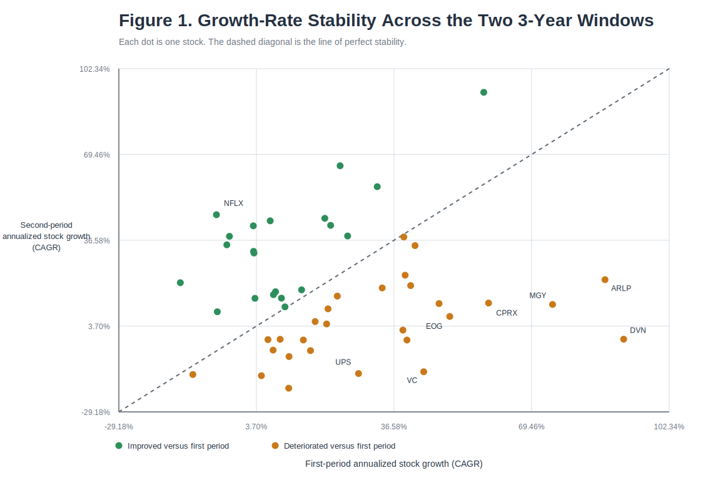
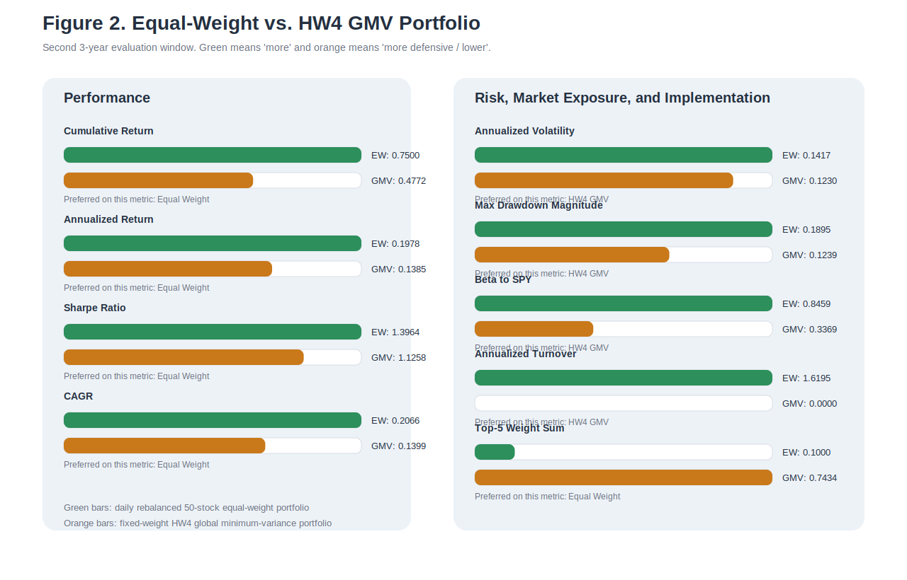

# Investment Strategy HW5

## Summary of Answers

| Question | Summary Answer |
| --- | --- |
| **Q1** | The risk-aversion formulation `max_x μ'x - λx'Σx` is equivalent to the reduced-form expected-return maximization problem `max_x μ'x` subject to a volatility cap. For every `λ >= 0`, the optimizer is an efficient portfolio. Conversely, every optimizer of the volatility-constrained problem is also an optimizer of the risk-aversion problem for `λ` equal to the KKT multiplier on the volatility constraint. |
| **Q2(a)** | Using the same two 3-year windows as in HW4 and excluding `GEHC` as instructed, the cross-sectional Pearson correlation between first-period and second-period annualized stock growth rates is only `0.04989`, and the Spearman rank correlation is `-0.00684`. This means growth-rate persistence is extremely weak and is even weaker than the `0.11068` mean-return stability correlation I found in HW4(k). |
| **Q2(b)** | The 50-stock daily rebalanced `1/n` portfolio over the second 3-year period produces cumulative return `74.99986%`, annualized return `19.78460%`, annualized volatility `14.16794%`, Sharpe ratio `1.39643`, maximum drawdown `-18.94706%`, CAGR `20.65684%`, average daily turnover `0.64266%`, and annualized turnover `161.94995%`. |
| **Q2(c)** | Relative to the HW4 long-only GMV portfolio, the rebalanced `1/n` portfolio earns higher cumulative return (`74.99986%` versus `47.71862%`) and a higher Sharpe ratio (`1.39643` versus `1.12583`), but it also has higher volatility (`14.16794%` versus `12.30208%`), a deeper maximum drawdown (`-18.94706%` versus `-12.38624%`), much higher market exposure (`β_{SPY}=0.84587` versus `0.33689`), and materially higher trading intensity. |

Supporting exhibits used in this write-up:

- `hw5_q2a_growth_rates.csv`
- `hw5_q2a_growth_summary.csv`
- `hw5_q2b_equal_weight_metrics.csv`
- `hw5_q2c_portfolio_comparison.csv`

## Conventions and Data Choices

I use the same local adjusted-close Tiingo dataset and the same two subperiods as in HW4 so that the HW5 results are directly comparable to the prior assignment.

- First 3-year return window: `2020-04-14` through `2023-04-12` (`755` daily return observations)
- Second 3-year return window: `2023-04-13` through `2026-04-10` (`751` daily return observations)
- Annualization convention: `252` trading days
- Return convention: simple daily total returns from adjusted close
- Transaction costs: ignored unless otherwise stated

There is one important asset-treatment detail:

- In **Q2(a)**, the assignment explicitly allows me to ignore the stock with no data in the first 3-year period, so I exclude `GEHC` and work with the remaining `49` stocks.
- In **Q2(b)**, the assignment explicitly asks for a `1/n` portfolio with the `50` stocks. By the beginning of the second 3-year period, `GEHC` already has live trading history, so I include all `50` stocks there.
- In **Q2(c)**, I compare that `50`-stock equal-weight portfolio with the actual HW4 optimal Markowitz portfolio, which was constructed from the first 3-year estimation window and therefore necessarily excluded `GEHC` in estimation.

## 1. Different Formulations of the Mean-Variance Framework

I begin by rewriting the two optimization problems in compact notation.

Let the feasible set be

$$
\mathcal{S} = \{x \in \mathbb{R}^n : \mathbf{1}'x = 1,\; x \ge 0\}.
$$

The reduced-form expected-return maximization problem with a volatility cap is

$$
\text{(P}_{\sigma_{\max}}\text{)} \qquad
\max_{x \in \mathcal{S}} \; \mu'x
\quad \text{subject to} \quad
x'\Sigma x \le \sigma_{\max}.
$$

The risk-aversion formulation is

$$
\text{(U}_{\lambda}\text{)} \qquad
\max_{x \in \mathcal{S}} \; \mu'x - \lambda x'\Sigma x,
\qquad \lambda \in [0,\infty).
$$

I now show carefully that these two formulations are equivalent descriptions of efficient portfolios.

### Step 1. Any optimizer of `(U_λ)` solves a volatility-constrained return-maximization problem

Take any fixed `λ >= 0`, and let `x_λ` be an optimizer of `(U_λ)`.

Define the variance level actually chosen by that optimizer as

$$
\bar{\sigma} = x_{\lambda}' \Sigma x_{\lambda}.
$$

I claim that `x_λ` must also solve `(P_{\bar{\sigma}})`, that is,

$$
\max_{x \in \mathcal{S}} \; \mu'x
\quad \text{subject to} \quad
x'\Sigma x \le \bar{\sigma}.
$$

To prove this, suppose the claim were false. Then there would exist some feasible portfolio `y \in \mathcal{S}` such that

$$
y'\Sigma y \le \bar{\sigma}
$$

and

$$
\mu'y > \mu'x_{\lambda}.
$$

Now compare the objective values in `(U_λ)`:

$$
\mu'y - \lambda y'\Sigma y
\ge
\mu'y - \lambda \bar{\sigma}
$$

because `y'\Sigma y <= \bar{\sigma}` and `\lambda >= 0`.

Since `\mu'y > \mu'x_\lambda`, we then obtain

$$
\mu'y - \lambda y'\Sigma y
>
\mu'x_{\lambda} - \lambda \bar{\sigma}.
$$

But by definition of `\bar{\sigma}`,

$$
\mu'x_{\lambda} - \lambda \bar{\sigma}
=
\mu'x_{\lambda} - \lambda x_{\lambda}'\Sigma x_{\lambda}.
$$

Therefore

$$
\mu'y - \lambda y'\Sigma y
>
\mu'x_{\lambda} - \lambda x_{\lambda}'\Sigma x_{\lambda},
$$

which contradicts the fact that `x_λ` is optimal for `(U_λ)`.

So the contradiction proves that `x_λ` indeed solves `(P_{\bar{\sigma}})`.

### Step 2. Any optimizer of `(U_λ)` is an efficient portfolio

I now show that `x_λ` cannot be dominated by another feasible portfolio.

Suppose, for contradiction, that `x_λ` were not efficient. Then there would exist some `y \in \mathcal{S}` such that

$$
\mu'y \ge \mu'x_{\lambda},
$$

$$
y'\Sigma y \le x_{\lambda}'\Sigma x_{\lambda},
$$

and at least one of these two inequalities would be strict.

If `\lambda > 0`, then

$$
\mu'y - \lambda y'\Sigma y
\ge
\mu'x_{\lambda} - \lambda x_{\lambda}'\Sigma x_{\lambda},
$$

and because at least one inequality is strict, the right-hand side is strictly improved:

$$
\mu'y - \lambda y'\Sigma y
>
\mu'x_{\lambda} - \lambda x_{\lambda}'\Sigma x_{\lambda}.
$$

That contradicts optimality of `x_λ` for `(U_λ)`.

If `\lambda = 0`, then `(U_0)` becomes

$$
\max_{x \in \mathcal{S}} \mu'x.
$$

In that case, any feasible `y` with strictly larger expected return would also contradict optimality. Therefore `x_0` is also efficient.

Hence every optimizer of `(U_λ)` is an efficient portfolio.

### Step 3. Converse direction via the KKT conditions

The previous two steps show that every solution to `(U_λ)` lies on the efficient frontier. To complete the equivalence, I now show that every solution to `(P_{\sigma_{\max}})` can be represented as a solution to `(U_λ)` for an appropriate `λ`.

Consider `(P_{\sigma_{\max}})` and write its Lagrangian:

$$
\mathcal{L}(x,\gamma,\alpha,\nu)
=
\mu'x
- \gamma (x'\Sigma x - \sigma_{\max})
+ \alpha(\mathbf{1}'x - 1)
+ \nu'x,
$$

where

- `\gamma >= 0` is the multiplier on the volatility constraint,
- `\alpha` is the multiplier on the full-investment constraint,
- `\nu >= 0` is the vector of multipliers on the long-only constraints.

The KKT first-order condition is

$$
\mu - 2\gamma \Sigma x + \alpha \mathbf{1} + \nu = 0.
$$

The remaining KKT conditions are

$$
x'\Sigma x \le \sigma_{\max}, \qquad \mathbf{1}'x = 1, \qquad x \ge 0,
$$

$$
\gamma \ge 0, \qquad \nu \ge 0,
$$

$$
\gamma(x'\Sigma x - \sigma_{\max}) = 0,
$$

$$
\nu_i x_i = 0 \quad \text{for each } i.
$$

Now look at `(U_λ)`. Its Lagrangian is

$$
\widetilde{\mathcal{L}}(x,\alpha,\nu)
=
\mu'x - \lambda x'\Sigma x + \alpha(\mathbf{1}'x - 1) + \nu'x,
$$

and its first-order condition is

$$
\mu - 2\lambda \Sigma x + \alpha \mathbf{1} + \nu = 0.
$$

These conditions are the same as the KKT conditions of `(P_{\sigma_{\max}})` once I set

$$
\lambda = \gamma^{\ast},
$$

where `\gamma^{\ast}` is the optimal multiplier on the volatility constraint.

There are two cases:

1. **The volatility constraint binds.**  
   Then `\gamma^{\ast} > 0` is the shadow value of relaxing the risk cap, and choosing `\lambda = \gamma^{\ast}` makes the first-order conditions identical.

2. **The volatility constraint does not bind.**  
   Then complementary slackness implies `\gamma^{\ast} = 0`, so the constrained problem reduces locally to pure expected-return maximization over `\mathcal{S}`. That is exactly `(U_0)`.

Therefore every optimizer of `(P_{\sigma_{\max}})` is also an optimizer of `(U_{\lambda})` for an appropriate `\lambda`.

### Conclusion for Question 1

I have now shown both directions:

- Every optimizer of the risk-aversion problem `(U_λ)` solves a reduced-form return-maximization problem with the volatility cap set equal to its own realized variance.
- Every optimizer of the reduced-form return-maximization problem `(P_{\sigma_{\max}})` solves the risk-aversion problem `(U_λ)` for `\lambda` equal to the KKT multiplier on the volatility constraint.

So the two formulations are equivalent descriptions of the efficient frontier. Put differently, the parameter `\lambda` is not generating a different class of portfolios; it is simply another way to index efficient portfolios.

## 2. Portfolio Construction: Single Period vs. Rebalancing

### 2(a) Sharpe-Style Analysis for Stock Growth Rates

The assignment asks me to repeat the spirit of HW4(k), but now for stock growth rates rather than the daily mean returns used in HW4(k).

Because the note explicitly says I may ignore the stock with no first-period data, I exclude `GEHC` and work with the remaining `49` stocks.

For each stock `i` and for each subperiod `s \in \{1,2\}`, let the daily adjusted-close total returns be `r_{i,t}^{(s)}` for `t = 1, \dots, T_s`.

I define the realized gross growth over subperiod `s` as

$$
\prod_{t=1}^{T_s}(1+r_{i,t}^{(s)}).
$$

I then annualize that realized growth rate using the same `252`-trading-day convention used in HW4:

$$
g_i^{(s)}
=
\left[
\prod_{t=1}^{T_s}(1+r_{i,t}^{(s)})
\right]^{252/T_s}
- 1.
$$

This gives one annualized realized growth rate for each stock in the first 3-year period and one annualized realized growth rate for the same stock in the second 3-year period.

Once these `49` pairs of growth rates are computed, I evaluate their cross-sectional stability exactly as in the Sharpe-style exercise: I compare the first-period vector `(g_i^{(1)})` with the second-period vector `(g_i^{(2)})`.

#### Main numerical findings

The summary results are:

- number of stocks used: `49`
- first-period observations per stock: `755`
- second-period observations per stock: `751`
- Pearson correlation between first-period and second-period annualized growth rates: `0.04989`
- Spearman rank correlation: `-0.00684`
- same-sign count: `32` out of `49` stocks (`65.30612%`)
- average first-period annualized growth rate: `22.98247%`
- average second-period annualized growth rate: `17.56853%`
- median first-period annualized growth rate: `17.73356%`
- median second-period annualized growth rate: `14.39860%`
- average absolute change in annualized growth rate across periods: `26.25568` percentage points

For reference, the mean-return stability correlation from HW4(k) was `0.11068`. So the growth-rate persistence here is even weaker than the already-weak return persistence from HW4(k).

#### Representative stock examples

Table 1 gives a few representative reversals and improvements. The full stock-by-stock table is in `hw5_q2a_growth_rates.csv`.

| Ticker | First-Period CAGR | Second-Period CAGR | Change |
| --- | ---: | ---: | ---: |
| DVN | 91.45679% | -1.33910% | -92.79588 pp |
| ARLP | 87.00016% | 21.48065% | -65.51951 pp |
| VC | 43.67419% | -13.81025% | -57.48444 pp |
| NFLX | -5.86314% | 46.36306% | 52.22620 pp |
| TSM | 23.69819% | 65.12551% | 41.42732 pp |
| CGAU | 2.95185% | 42.11031% | 39.15846 pp |

Figure 1 plots first-period versus second-period annualized stock growth. If growth were stable across periods, the dots would cluster tightly around the diagonal. They clearly do not.

#### Does this make sense relative to HW4(k)?

Yes, it does make sense.

In HW4(k), my main conclusion was that expected-return estimates were much less stable across the two subperiods than volatilities and correlations. The current result is fully consistent with that conclusion, and in fact it is even stronger:

- the HW4(k) mean-return stability correlation was only `0.11068`;
- the HW5 growth-rate stability correlation is even lower at `0.04989`;
- the Spearman rank correlation is essentially zero (`-0.00684`), which means even the ranking of “growth winners” versus “growth losers” is not persistent.

Economically, this also makes sense. The first and second 3-year windows were very different market environments. Energy-related names such as `DVN`, `ARLP`, and `MGY` were exceptionally strong in the first window and much weaker in the second window. By contrast, several large technology and growth names such as `NFLX`, `TSM`, `META`, and `NVDA` were much stronger in the second window. So the weak persistence is not a numerical accident; it reflects genuine regime dependence in realized stock growth.

My conclusion for part (a) is therefore straightforward: realized stock growth over one 3-year period provides very little reliable information about realized stock growth over the next 3-year period in this sample. That conclusion is fully aligned with the warning from HW4(k) that return-related quantities are highly unstable across subperiods.

### 2(b) Daily Rebalanced `1/n` Portfolio in the Second 3-Year Period

For this part I follow the assignment literally and construct a `1/n` portfolio with the full `50` stocks at the beginning of the second 3-year period.

Since `n = 50`, the target weight on each stock is

$$
w_i = \frac{1}{50} = 0.02000.
$$

The portfolio is rebalanced daily, so after each trading day the weights are reset to `2.00000%` per stock for the following day.

#### Daily portfolio return formula

Let `r_{i,t}` denote the realized daily return of stock `i` on day `t` in the second 3-year period.

Because the beginning-of-day weights are equal each day, the portfolio return on day `t` is

$$
r_{p,t}^{EW}
=
\sum_{i=1}^{50} w_i r_{i,t}
=
\frac{1}{50}\sum_{i=1}^{50} r_{i,t}.
$$

The cumulative wealth process therefore evolves as

$$
V_t = V_{t-1}(1+r_{p,t}^{EW}),
$$

with `V_0 = 1`.

#### Turnover formula

Daily rebalancing has a trading implication, so I also report turnover.

If the portfolio starts day `t` with equal weights `1/50`, then after the day’s returns but before rebalancing, the drifted weight on stock `i` is

$$
\widetilde{w}_{i,t}
=
\frac{\frac{1}{50}(1+r_{i,t})}{1+r_{p,t}^{EW}}.
$$

To rebalance back to equal weights, the one-way turnover on day `t` is

$$
\tau_t
=
\frac{1}{2}\sum_{i=1}^{50}
\left|
\widetilde{w}_{i,t} - \frac{1}{50}
\right|.
$$

I report both the average daily turnover and the corresponding annualized turnover `252 \times \bar{\tau}`.

#### Performance metrics

Using the `751` daily observations from `2023-04-13` through `2026-04-10`, the rebalanced equal-weight portfolio has:

- cumulative return: `74.99986%`
- annualized return: `19.78460%`
- annualized volatility: `14.16794%`
- Sharpe ratio: `1.39643`
- maximum drawdown: `-18.94706%`
- CAGR: `20.65684%`
- average daily turnover: `0.64266%`
- annualized turnover: `161.94995%`

I also compute two additional portfolio-characterization metrics that are relevant for part (c):

- beta to `SPY`: `0.84587`
- correlation with `SPY`: `0.90823`

Table 2 summarizes the equal-weight portfolio results.

| Metric | Value |
| --- | ---: |
| Observations | 751 |
| Cumulative Return | 74.99986% |
| Annualized Return | 19.78460% |
| Annualized Volatility | 14.16794% |
| Sharpe Ratio | 1.39643 |
| Max Drawdown | -18.94706% |
| CAGR | 20.65684% |
| Average Daily Turnover | 0.64266% |
| Annualized Turnover | 161.94995% |
| Beta to SPY | 0.84587 |
| Correlation to SPY | 0.90823 |

These values indicate that the equal-weight portfolio delivered strong realized performance over this specific second-period window, but it did so with meaningful market exposure and a nontrivial rebalancing burden.

### 2(c) Comparison with the HW4 Optimal Markowitz Portfolio

The comparison portfolio from HW4 is the long-only global minimum-variance portfolio estimated from the first 3-year window and then held fixed through the second 3-year evaluation window.

From HW4, that portfolio’s realized second-period performance was:

- cumulative return: `47.71862%`
- annualized return: `13.85000%`
- annualized volatility: `12.30208%`
- Sharpe ratio: `1.12583`
- maximum drawdown: `-12.38624%`
- CAGR: `13.98677%`

For a more informative portfolio-characterization comparison, I also report:

- beta to `SPY`: `0.33689`
- correlation with `SPY`: `0.41659`
- effective number of names: `6.94423`
- top-5 weight sum: `74.34459%`

By contrast, the equal-weight portfolio has:

- beta to `SPY`: `0.84587`
- correlation with `SPY`: `0.90823`
- effective number of names: exactly `50.00000`
- top-5 weight sum: exactly `10.00000%`

Table 3 places the two portfolios side by side.

| Metric | Equal-Weight `1/n` | HW4 GMV Portfolio |
| --- | ---: | ---: |
| Assets Included | 50 | 49 |
| Rebalanced Daily | Yes | No |
| Cumulative Return | 74.99986% | 47.71862% |
| Annualized Return | 19.78460% | 13.85000% |
| Annualized Volatility | 14.16794% | 12.30208% |
| Sharpe Ratio | 1.39643 | 1.12583 |
| Max Drawdown | -18.94706% | -12.38624% |
| CAGR | 20.65684% | 13.98677% |
| Beta to SPY | 0.84587 | 0.33689 |
| Correlation to SPY | 0.90823 | 0.41659 |
| Effective Names | 50.00000 | 6.94423 |
| Top-5 Weight Sum | 10.00000% | 74.34459% |
| Average Daily Turnover | 0.64266% | 0.00000% |
| Annualized Turnover | 161.94995% | 0.00000% |

Figure 2 compares the equal-weight and HW4 GMV portfolios along the dimensions that matter most in part (c): performance, risk, market exposure, concentration, and trading intensity.

#### Direct numerical comparison

Relative to the HW4 GMV portfolio, the equal-weight portfolio has:

- `+27.28124` percentage points higher cumulative return
- `+5.93461` percentage points higher annualized return
- `+1.86586` percentage points higher annualized volatility
- `+0.27061` higher Sharpe ratio
- a drawdown deeper by `6.56083` percentage points
- `+6.67007` percentage points higher CAGR

#### Advantages of the rebalanced equal-weight portfolio

The equal-weight portfolio has several clear advantages in this realized second-period sample.

First, it performs better on the two headline reward metrics: realized return and realized Sharpe ratio. In this specific second-period window, a simple diversified `1/n` rule beats the optimized GMV rule on both total performance and risk-adjusted performance.

Second, it is much less exposed to estimation error. The equal-weight portfolio does not require estimating a covariance matrix and then solving an optimizer that can amplify small estimation differences. That robustness matters because HW4(k) already showed that return-related quantities were not stable across periods.

Third, it is far more diversified in weight concentration. The equal-weight portfolio spreads capital uniformly across `50` stocks, whereas the GMV portfolio is highly concentrated. Its effective number of names is only `6.94423`, and nearly three-quarters of the capital (`74.34459%`) sit in the top five positions. That concentration makes the GMV portfolio more vulnerable to model error and to stock-specific shocks in a small number of names.

Fourth, this specific second-period sample rewarded broad equity exposure. The equal-weight portfolio’s beta to `SPY` is `0.84587`, so it participated much more fully in the realized market upside than the GMV portfolio, whose beta was only `0.33689`.

#### Advantages of the HW4 GMV portfolio

The GMV portfolio also has important advantages.

First, it is meaningfully more defensive. Its beta to `SPY` is only `0.33689`, versus `0.84587` for the equal-weight portfolio. Its correlation with `SPY` is also much lower (`0.41659` versus `0.90823`). So the GMV portfolio behaves much less like a broad equity market portfolio.

Second, it achieves lower realized volatility and a much smaller drawdown. Even though it underperforms on return, it fulfills its intended role as a low-variance portfolio: realized volatility is only `12.30208%`, versus `14.16794%` for equal weight, and the maximum drawdown is materially smaller in magnitude (`-12.38624%` versus `-18.94706%`).

Third, it requires essentially no rebalancing during the second-period holding window in the way I implemented HW4. That means its realized return is not exposed to the same level of turnover-related transaction-cost risk as the equal-weight portfolio, whose annualized turnover is `161.94995%`.

#### Interpretation

The realized second-period evidence suggests the following.

If the investor cares most about realized return and realized Sharpe ratio over this particular evaluation window, the daily rebalanced equal-weight portfolio looks better. It is simple, broadly diversified, and it outperforms the GMV portfolio in this sample.

If the investor instead cares more about downside protection, low market exposure, and lower implementation trading, then the HW4 GMV portfolio still has a defensible advantage. Its lower volatility, lower drawdown, and much lower beta are not accidents; they are exactly what a minimum-variance allocation is designed to deliver.

So my bottom-line comparison is:

- the equal-weight portfolio is the stronger performer in this realized second-period sample;
- the GMV portfolio is the more defensive and lower-implementation-risk portfolio;
- the superiority of equal weight here should not be interpreted as a general theorem, because this comparison is period-specific and strongly affected by the realized market environment.

## Supporting Exhibits

- Appendix A: `hw5_q2a_growth_rates.csv`
- Appendix B: `hw5_q2a_growth_summary.csv`
- Appendix C: `hw5_q2b_equal_weight_metrics.csv`
- Appendix D: `hw5_q2c_portfolio_comparison.csv`
- Appendix E: `hw5_summary_metrics.csv`
