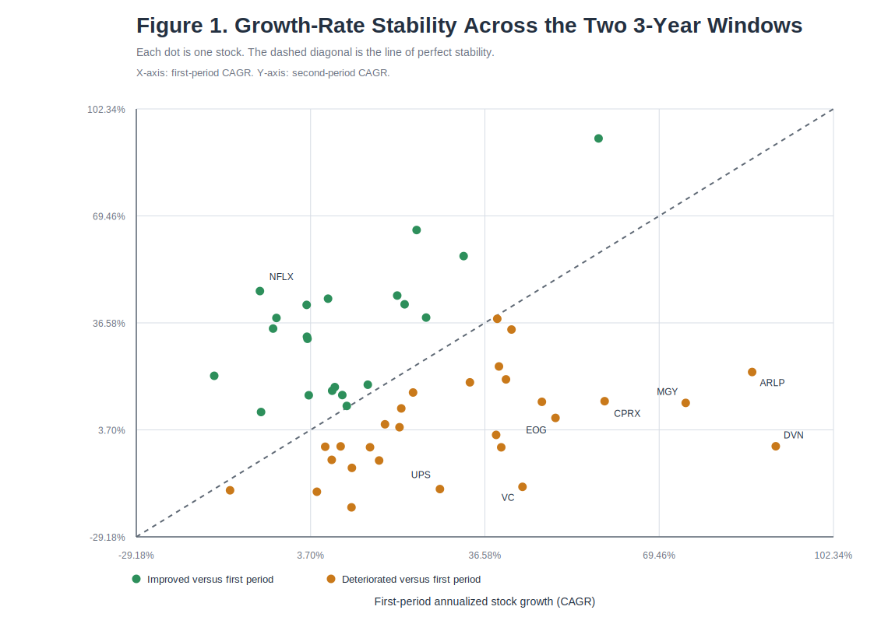
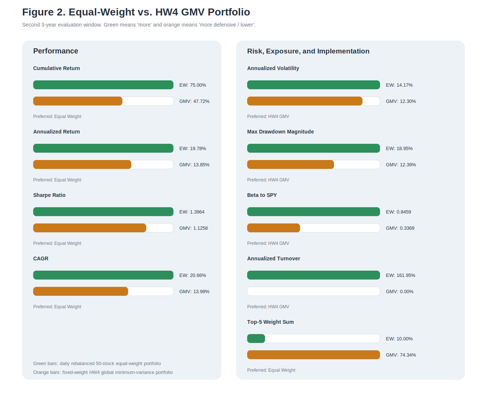

# Investment Strategy HW5

## Summary of Answers

- **Q1.** The risk-aversion formulation of mean-variance optimization is equivalent to the variance-capped expected-return maximization problem. For every strictly positive risk-aversion parameter, the optimizer is an efficient portfolio. The case `lambda = 0` corresponds to the maximum-return endpoint of the frontier, with the usual minimum-variance tie-break among return-maximizing portfolios. Conversely, every optimizer of the variance-constrained problem can be recovered from the risk-aversion problem by choosing the risk-aversion parameter equal to the KKT multiplier on the variance cap.
- **Q2(a).** Using the same two 3-year windows as in HW4 and excluding `GEHC` as instructed, the cross-sectional Pearson correlation between first-period and second-period annualized stock growth rates is only `0.04989`, and the Spearman rank correlation is `-0.00684`. Growth-rate persistence is therefore extremely weak and is even weaker than the `0.11068` mean-return stability correlation from HW4(k).
- **Q2(b).** The 50-stock daily rebalanced `1/n` portfolio over the second 3-year period produces cumulative return `74.99986%`, annualized return `19.78460%`, annualized volatility `14.16794%`, Sharpe ratio `1.39643`, maximum drawdown `-18.94706%`, CAGR `20.65684%`, average daily turnover `0.64266%`, and annualized turnover `161.94995%`.
- **Q2(c).** Relative to the HW4 long-only GMV portfolio, the rebalanced `1/n` portfolio earns higher cumulative return and a higher Sharpe ratio, but it also has higher volatility, a deeper maximum drawdown, a much higher beta to `SPY`, and materially higher trading intensity.

Supporting exhibits are provided as Appendix A through Appendix F:

- Appendix A: Q2(a) stock-level growth rates ([`hw5_q2a_growth_rates.csv`](../exhibits/hw5_q2a_growth_rates.csv))
- Appendix B: Q2(a) growth-rate summary ([`hw5_q2a_growth_summary.csv`](../exhibits/hw5_q2a_growth_summary.csv))
- Appendix C: Q2(b) equal-weight portfolio metrics ([`hw5_q2b_equal_weight_metrics.csv`](../exhibits/hw5_q2b_equal_weight_metrics.csv))
- Appendix D: Q2(c) equal-weight versus HW4 GMV comparison ([`hw5_q2c_portfolio_comparison.csv`](../exhibits/hw5_q2c_portfolio_comparison.csv))
- Appendix E: compact summary metrics ([`hw5_summary_metrics.csv`](../exhibits/hw5_summary_metrics.csv))
- Appendix F: selected code snippets from [`code/hw5_analysis.py`](../code/hw5_analysis.py)

The compact cross-question metrics behind the summary bullets above are collected in Appendix E. The representative implementation snippets used in Sections 2(a) through 2(c) are collected in Appendix F.

## Conventions and Data Choices

I use the same local adjusted-close Tiingo dataset and the same two subperiods as in HW4 so that the HW5 results are directly comparable to the prior assignment.

- First 3-year return window: `2020-04-14` through `2023-04-12` (`755` daily return observations)
- Second 3-year return window: `2023-04-13` through `2026-04-10` (`751` daily return observations)
- Annualization convention: `252` trading days
- Return convention: simple daily total returns from adjusted close
- Transaction costs: ignored unless otherwise stated

There is one important asset-treatment detail:

- In **Q2(a)**, the assignment explicitly allows me to ignore the stock with no data in the first 3-year period, so I exclude `GEHC` and work with the remaining `49` stocks.
- In **Q2(b)**, the assignment explicitly asks for a `1/n` portfolio with the `50` stocks. By the beginning of the second 3-year period, `GEHC` already has live trading history, so I include all `50` stocks there.
- In **Q2(c)**, I compare that `50`-stock equal-weight portfolio with the actual HW4 optimal Markowitz portfolio, which was constructed from the first 3-year estimation window and therefore necessarily excluded `GEHC` in estimation.

## Data and Implementation Notes

- The main numerical calculations and CSV exhibits for Q2(a), Q2(b), and Q2(c) are implemented in [`code/hw5_analysis.py`](../code/hw5_analysis.py).
- The two SVG figures used in the write-up are generated by [`code/generate_hw5_figures.py`](../code/generate_hw5_figures.py).
- Appendix A through Appendix D correspond to the machine-generated exhibit files stored in `exhibits/`.
- Appendix E reproduces the compact summary-metrics exhibit inside the write-up for grading convenience.
- Appendix F reproduces representative code snippets from [`code/hw5_analysis.py`](../code/hw5_analysis.py) so that the computational logic is visible in the write-up itself, as in HW4.

## 1. Different Formulations of the Mean-Variance Framework

I begin by rewriting the two optimization problems in compact notation.

Let the feasible set be

```math
\mathcal{S} = \{x \in \mathbb{R}^n : \mathbf{1}'x = 1,\; x \ge 0\}.
```


The reduced-form expected-return maximization problem with a variance cap is

```math
\text{(P}_{\sigma_{\max}}\text{)} \qquad
\max_{x \in \mathcal{S}} \; \mu'x
\quad \text{subject to} \quad
x'\Sigma x \le \sigma_{\max}.
```


The risk-aversion formulation is

```math
\text{(U}_{\lambda}\text{)} \qquad
\max_{x \in \mathcal{S}} \; \mu'x - \lambda x'\Sigma x,
\qquad \lambda \in [0,\infty).
```


I now show carefully that these two formulations are equivalent descriptions of efficient portfolios.

### Step 1. A Risk-Aversion Optimizer Solves a Variance-Constrained Return-Maximization Problem

Take any fixed risk-aversion parameter `lambda >= 0`, and let `x_lambda` be an optimizer of problem `U_lambda`.

Define the variance level actually chosen by that optimizer as

```math
\bar{\sigma} = x_{\lambda}' \Sigma x_{\lambda}.
```


I claim that `x_lambda` must also solve the reduced-form return-maximization problem with variance cap equal to its own realized variance, that is,

```math
\max_{x \in \mathcal{S}} \; \mu'x
\quad \text{subject to} \quad
x'\Sigma x \le \bar{\sigma}.
```


To prove this, suppose the claim were false. Then there would exist some feasible portfolio `y` in the feasible set such that

```math
y'\Sigma y \le \bar{\sigma}
```


and

```math
\mu'y > \mu'x_{\lambda}.
```


Now compare the objective values in problem `U_lambda`:

```math
\mu'y - \lambda y'\Sigma y
\ge
\mu'y - \lambda \bar{\sigma}
```


because `y` satisfies the variance cap and `lambda >= 0`.

Since `y` has strictly higher expected return than `x_lambda`, we then obtain

```math
\mu'y - \lambda y'\Sigma y
>
\mu'x_{\lambda} - \lambda \bar{\sigma}.
```


But by definition of the realized variance cap,

```math
\mu'x_{\lambda} - \lambda \bar{\sigma}
=
\mu'x_{\lambda} - \lambda x_{\lambda}'\Sigma x_{\lambda}.
```


Therefore

```math
\mu'y - \lambda y'\Sigma y
>
\mu'x_{\lambda} - \lambda x_{\lambda}'\Sigma x_{\lambda},
```


which contradicts the fact that `x_lambda` is optimal for `U_lambda`.

So the contradiction proves that `x_lambda` indeed solves the reduced-form problem with variance cap equal to its own realized variance.

### Step 2. Positive Risk Aversion Implies Efficiency; Zero Risk Aversion Gives the Frontier Endpoint

I first treat the case `lambda > 0` and show that `x_lambda` cannot be dominated by another feasible portfolio.

Suppose, for contradiction, that `x_lambda` were not efficient. Then there would exist some feasible portfolio `y` such that

```math
\mu'y \ge \mu'x_{\lambda},
```


```math
y'\Sigma y \le x_{\lambda}'\Sigma x_{\lambda},
```


and at least one of these two inequalities would be strict.

If `lambda > 0`, then

```math
\mu'y - \lambda y'\Sigma y
\ge
\mu'x_{\lambda} - \lambda x_{\lambda}'\Sigma x_{\lambda},
```


and because at least one inequality is strict, the right-hand side is strictly improved:

```math
\mu'y - \lambda y'\Sigma y
>
\mu'x_{\lambda} - \lambda x_{\lambda}'\Sigma x_{\lambda}.
```


That contradicts optimality of `x_lambda` for `U_lambda`.

This proves efficiency for every optimizer of `U_lambda` with `lambda > 0`.

If `lambda = 0`, then `U_0` becomes

```math
\max_{x \in \mathcal{S}} \mu'x.
```


In that case, the objective only selects portfolios with maximal expected return. In general, if several portfolios attain the same maximal expected return, not every such maximizer must also have the smallest variance among that set. To match the efficient frontier exactly, I therefore interpret the `lambda = 0` case as follows: among all solutions to `U_0`, select one with the smallest variance.

Call that selected portfolio `x_0_min_sigma`. If there were some feasible portfolio `y` with

```math
\mu'y \ge \mu'x_0^{\min \sigma},
```


```math
y'\Sigma y \le (x_0^{\min \sigma})'\Sigma x_0^{\min \sigma},
```


and at least one strict inequality, then either:

- `y` has strictly higher expected return than `x_0_min_sigma`, contradicting the fact that `x_0_min_sigma` solves `U_0`; or
- `y` has the same expected return as `x_0_min_sigma` but strictly lower variance, contradicting the minimum-variance tie-break among return-maximizing portfolios.

So `x_0_min_sigma` is the maximum-return endpoint of the efficient frontier.

### Step 3. Converse direction via the KKT conditions

The previous two steps show that every solution to `U_lambda` lies on the efficient frontier. To complete the equivalence, I now show that every solution to the variance-capped problem can be represented as a solution to `U_lambda` for an appropriate value of `lambda`.

Consider the variance-capped problem and write its Lagrangian:

```math
\mathcal{L}(x,\gamma,\alpha,\nu)
=
\mu'x
- \gamma (x'\Sigma x - \sigma_{\max})
+ \alpha(\mathbf{1}'x - 1)
+ \nu'x,
```


where

- `gamma >= 0` is the multiplier on the variance constraint,
- `alpha` is the multiplier on the full-investment constraint,
- `nu >= 0` is the vector of multipliers on the long-only constraints.

The KKT first-order condition is

```math
\mu - 2\gamma \Sigma x + \alpha \mathbf{1} + \nu = 0.
```


The remaining KKT conditions are

```math
x'\Sigma x \le \sigma_{\max}, \qquad \mathbf{1}'x = 1, \qquad x \ge 0,
```


```math
\gamma \ge 0, \qquad \nu \ge 0,
```


```math
\gamma(x'\Sigma x - \sigma_{\max}) = 0,
```


```math
\nu_i x_i = 0 \quad \text{for each } i.
```


Now look at `U_lambda`. Its Lagrangian is

```math
\widetilde{\mathcal{L}}(x,\alpha,\nu)
=
\mu'x - \lambda x'\Sigma x + \alpha(\mathbf{1}'x - 1) + \nu'x,
```


and its first-order condition is

```math
\mu - 2\lambda \Sigma x + \alpha \mathbf{1} + \nu = 0.
```


These conditions are the same as the KKT conditions of the variance-capped problem once I set

```math
\lambda = \gamma^{\ast},
```


where `gamma_star` is the optimal multiplier on the variance constraint.

There are two cases:

1. **The variance constraint binds.**  
   Then `gamma_star > 0` is the shadow value of relaxing the variance cap, and choosing `lambda = gamma_star` makes the first-order conditions identical.

2. **The variance constraint does not bind.**  
   Then complementary slackness implies `gamma_star = 0`, so the constrained problem reduces locally to pure expected-return maximization over the feasible set. That is exactly `U_0`; if there are multiple return-maximizers, the efficient-frontier endpoint is obtained by choosing the minimum-variance one among them.

Therefore every optimizer of the variance-capped problem is also an optimizer of `U_lambda` for an appropriate value of `lambda`.

### Conclusion for Question 1

I have now shown both directions:

- Every optimizer of the risk-aversion problem `U_lambda` with `lambda > 0` solves a reduced-form return-maximization problem with the variance cap set equal to its own realized variance and is efficient.
- The case `lambda = 0` corresponds to the maximum-return endpoint of the frontier, with the usual minimum-variance tie-break among return-maximizing portfolios.
- Every optimizer of the reduced-form return-maximization problem with a variance cap solves the risk-aversion problem `U_lambda` for `lambda` equal to the KKT multiplier on the variance constraint.

So the two formulations are equivalent descriptions of the efficient frontier once the endpoint case `lambda = 0` is interpreted correctly. Put differently, the parameter `lambda` is not generating a different class of portfolios; it is simply another way to index efficient portfolios.

## 2. Portfolio Construction: Single Period vs. Rebalancing

### 2(a) Sharpe-Style Analysis for Stock Growth Rates

The assignment asks me to repeat the spirit of HW4(k), but now for stock growth rates rather than the daily mean returns used in HW4(k).

Because the note explicitly says I may ignore the stock with no first-period data, I exclude `GEHC` and work with the remaining `49` stocks.

For each stock index `i` and each subperiod `s in {1,2}`, let the daily adjusted-close total returns be denoted by `r_{i,t}^{(s)}` for `t = 1, ..., T_s`.

I define the realized gross growth over subperiod `s` as

```math
\prod_{t=1}^{T_s}(1+r_{i,t}^{(s)}).
```


I then annualize that realized growth rate using the same `252`-trading-day convention used in HW4:

```math
g_i^{(s)}
=
\left[
\prod_{t=1}^{T_s}(1+r_{i,t}^{(s)})
\right]^{252/T_s}
- 1.
```


This gives one annualized realized growth rate for each stock in the first 3-year period and one annualized realized growth rate for the same stock in the second 3-year period.

Once these `49` pairs of growth rates are computed, I evaluate their cross-sectional stability exactly as in the Sharpe-style exercise: I compare the first-period growth vector `g_i^{(1)}` with the second-period growth vector `g_i^{(2)}`.

The Q2(a) growth-rate construction and stability calculations are implemented in [`code/hw5_analysis.py`](../code/hw5_analysis.py); Appendix F.1 reproduces the representative snippet. The code excerpt below is taken from that file:

```python
growth_rows = []
first_growth = []
second_growth = []
for ticker in stocks_49:
    g1 = compounded_annual_growth([returns[ticker][date] for date in first_dates])
    g2 = compounded_annual_growth([returns[ticker][date] for date in second_dates_49])
    first_growth.append(g1)
    second_growth.append(g2)
    growth_rows.append({"Ticker": ticker, "FirstPeriodCAGR": g1, "SecondPeriodCAGR": g2})

pearson = correlation(first_growth, second_growth)
spearman = correlation(ranks(first_growth), ranks(second_growth))
```

The same logic is reproduced again in Appendix F.1 together with its appendix heading.

#### Main numerical findings

The summary results are:

- number of stocks used: `49`
- first-period observations per stock: `755`
- second-period observations per stock: `751`
- Pearson correlation between first-period and second-period annualized growth rates: `0.04989`
- Spearman rank correlation: `-0.00684`
- same-sign count: `32` out of `49` stocks (`65.30612%`)
- average first-period annualized growth rate: `22.98247%`
- average second-period annualized growth rate: `17.56853%`
- median first-period annualized growth rate: `17.73356%`
- median second-period annualized growth rate: `14.39860%`
- average absolute change in annualized growth rate across periods: `26.25568` percentage points

For reference, the mean-return stability correlation from HW4(k) was `0.11068`. So the growth-rate persistence here is even weaker than the already-weak return persistence from HW4(k).

The compact metric summary reported in this subsection is provided as Appendix B ([`hw5_q2a_growth_summary.csv`](../exhibits/hw5_q2a_growth_summary.csv)).

#### Representative stock examples

Table 1 gives a few representative reversals and improvements. The full stock-by-stock exhibit is provided as Appendix A ([`hw5_q2a_growth_rates.csv`](../exhibits/hw5_q2a_growth_rates.csv)).

| Ticker | First-Period CAGR | Second-Period CAGR | Change |
| --- | ---: | ---: | ---: |
| DVN | 91.45679% | -1.33910% | -92.79588 pp |
| ARLP | 87.00016% | 21.48065% | -65.51951 pp |
| VC | 43.67419% | -13.81025% | -57.48444 pp |
| NFLX | -5.86314% | 46.36306% | 52.22620 pp |
| TSM | 23.69819% | 65.12551% | 41.42732 pp |
| CGAU | 2.95185% | 42.11031% | 39.15846 pp |

<div class="figure-block">
<p class="figure-note">Figure 1 plots first-period versus second-period annualized stock growth. If growth were stable across periods, the dots would cluster tightly around the diagonal. They clearly do not.</p>

</div>

#### Does this make sense relative to HW4(k)?

Yes, it does make sense.

In HW4(k), my main conclusion was that expected-return estimates were much less stable across the two subperiods than volatilities and correlations. The current result is fully consistent with that conclusion, and in fact it is even stronger:

- the HW4(k) mean-return stability correlation was only `0.11068`;
- the HW5 growth-rate stability correlation is even lower at `0.04989`;
- the Spearman rank correlation is essentially zero (`-0.00684`), which means even the ranking of “growth winners” versus “growth losers” is not persistent.

Economically, this also makes sense. The first and second 3-year windows were very different market environments. Energy-related names such as `DVN`, `ARLP`, and `MGY` were exceptionally strong in the first window and much weaker in the second window. By contrast, several large technology and growth names such as `NFLX`, `TSM`, `META`, and `NVDA` were much stronger in the second window. So the weak persistence is not a numerical accident; it reflects genuine regime dependence in realized stock growth.

My conclusion for part (a) is therefore straightforward: realized stock growth over one 3-year period provides very little reliable information about realized stock growth over the next 3-year period in this sample. That conclusion is fully aligned with the warning from HW4(k) that return-related quantities are highly unstable across subperiods.

### 2(b) Daily Rebalanced `1/n` Portfolio in the Second 3-Year Period

For this part I follow the assignment literally and construct a `1/n` portfolio with the full `50` stocks at the beginning of the second 3-year period.

Since `n = 50`, the target weight on each stock is

```math
w_i = \frac{1}{50} = 0.02000.
```


The portfolio is rebalanced daily, so after each trading day the weights are reset to `2.00000%` per stock for the following day.

#### Daily portfolio return formula

Let `r_{i,t}` denote the realized daily return of stock `i` on day `t` in the second 3-year period.

Because the beginning-of-day weights are equal each day, the portfolio return on day `t` is

```math
r_{p,t}^{EW}
=
\sum_{i=1}^{50} w_i r_{i,t}
=
\frac{1}{50}\sum_{i=1}^{50} r_{i,t}.
```


The cumulative wealth process therefore evolves as

```math
V_t = V_{t-1}(1+r_{p,t}^{EW}),
```


with `V_0 = 1`.

#### Turnover formula

Daily rebalancing has a trading implication, so I also report turnover.

If the portfolio starts day `t` with equal weights `1/50`, then after the day’s returns but before rebalancing, the drifted weight on stock `i` is

```math
\widetilde{w}_{i,t}
=
\frac{\frac{1}{50}(1+r_{i,t})}{1+r_{p,t}^{EW}}.
```


To rebalance back to equal weights, the one-way turnover on day `t` is

```math
\tau_t
=
\frac{1}{2}\sum_{i=1}^{50}
\left|
\widetilde{w}_{i,t} - \frac{1}{50}
\right|.
```


I report both the average daily turnover and the corresponding annualized turnover, computed as `252` times the average daily turnover.

The daily rebalanced equal-weight portfolio and turnover calculations are implemented in [`code/hw5_analysis.py`](../code/hw5_analysis.py); Appendix F.2 reproduces the representative snippet. The code excerpt below is taken from that file:

```python
r2_50 = [[returns[ticker][date] for ticker in all_stocks] for date in second_dates_50]
eq_returns = [sum(row) / len(row) for row in r2_50]
eq_metrics = metrics(eq_returns)
eq_turnovers = [equal_weight_turnover(row) for row in r2_50]

def equal_weight_turnover(day_returns):
    n_assets = len(day_returns)
    target = 1.0 / n_assets
    post_weights_unnormalized = [target * (1.0 + ret) for ret in day_returns]
    gross_return = sum(post_weights_unnormalized)
    post_weights = [weight / gross_return for weight in post_weights_unnormalized]
    return 0.5 * sum(abs(weight - target) for weight in post_weights)
```

The same logic is reproduced again in Appendix F.2 together with its appendix heading.

#### Performance metrics

Using the `751` daily observations from `2023-04-13` through `2026-04-10`, the rebalanced equal-weight portfolio has:

- cumulative return: `74.99986%`
- annualized return: `19.78460%`
- annualized volatility: `14.16794%`
- Sharpe ratio: `1.39643`
- maximum drawdown: `-18.94706%`
- CAGR: `20.65684%`
- average daily turnover: `0.64266%`
- annualized turnover: `161.94995%`

I also compute two additional portfolio-characterization metrics that are relevant for part (c):

- beta to `SPY`: `0.84587`
- correlation with `SPY`: `0.90823`

Table 2 summarizes the equal-weight portfolio results.

| Metric | Value |
| --- | ---: |
| Observations | 751 |
| Cumulative Return | 74.99986% |
| Annualized Return | 19.78460% |
| Annualized Volatility | 14.16794% |
| Sharpe Ratio | 1.39643 |
| Max Drawdown | -18.94706% |
| CAGR | 20.65684% |
| Average Daily Turnover | 0.64266% |
| Annualized Turnover | 161.94995% |
| Beta to SPY | 0.84587 |
| Correlation to SPY | 0.90823 |

The full CSV version of Table 2 is provided as Appendix C ([`hw5_q2b_equal_weight_metrics.csv`](../exhibits/hw5_q2b_equal_weight_metrics.csv)).

These values indicate that the equal-weight portfolio delivered strong realized performance over this specific second-period window, but it did so with meaningful market exposure and a nontrivial rebalancing burden.

### 2(c) Comparison with the HW4 Optimal Markowitz Portfolio

The comparison portfolio from HW4 is the long-only global minimum-variance portfolio estimated from the first 3-year window and then held fixed through the second 3-year evaluation window.

From HW4, that portfolio’s realized second-period performance was:

- cumulative return: `47.71862%`
- annualized return: `13.85000%`
- annualized volatility: `12.30208%`
- Sharpe ratio: `1.12583`
- maximum drawdown: `-12.38624%`
- CAGR: `13.98677%`

For a more informative portfolio-characterization comparison, I also report:

- beta to `SPY`: `0.33689`
- correlation with `SPY`: `0.41659`
- effective number of names: `6.94423`
- top-5 weight sum: `74.34459%`

By contrast, the equal-weight portfolio has:

- beta to `SPY`: `0.84587`
- correlation with `SPY`: `0.90823`
- effective number of names: exactly `50.00000`
- top-5 weight sum: exactly `10.00000%`

The Q2(c) comparison is assembled in [`code/hw5_analysis.py`](../code/hw5_analysis.py); Appendix F.3 reproduces the representative snippet. The code excerpt below is taken from that file:

```python
gmv_weights = solve_gmv(sigma1_49)
gmv_returns = [
    sum(row[idx] * gmv_weights[idx] for idx in range(len(gmv_weights)))
    for row in r2_49
]

comparison_rows = [
    {
        "Portfolio": "Equal Weight 1/n",
        "Beta to SPY": covariance(eq_returns, spy_second) / variance(spy_second),
        "Effective Names": 50.0,
        "Top-5 Weight Sum": 0.10000000,
    },
    {
        "Portfolio": "HW4 GMV",
        "Beta to SPY": covariance(gmv_returns, spy_second) / variance(spy_second),
        "Effective Names": effective_names(gmv_weights),
        "Top-5 Weight Sum": sum(sorted(gmv_weights, reverse=True)[:5]),
    },
]
```

The same logic is reproduced again in Appendix F.3 together with its appendix heading.

Table 3 places the two portfolios side by side.

| Metric | Equal-Weight `1/n` | HW4 GMV Portfolio |
| --- | ---: | ---: |
| Assets Included | 50 | 49 |
| Rebalanced Daily | Yes | No |
| Cumulative Return | 74.99986% | 47.71862% |
| Annualized Return | 19.78460% | 13.85000% |
| Annualized Volatility | 14.16794% | 12.30208% |
| Sharpe Ratio | 1.39643 | 1.12583 |
| Max Drawdown | -18.94706% | -12.38624% |
| CAGR | 20.65684% | 13.98677% |
| Beta to SPY | 0.84587 | 0.33689 |
| Correlation to SPY | 0.90823 | 0.41659 |
| Effective Names | 50.00000 | 6.94423 |
| Top-5 Weight Sum | 10.00000% | 74.34459% |
| Average Daily Turnover | 0.64266% | 0.00000% |
| Annualized Turnover | 161.94995% | 0.00000% |

The full CSV version of Table 3 is provided as Appendix D ([`hw5_q2c_portfolio_comparison.csv`](../exhibits/hw5_q2c_portfolio_comparison.csv)).

<div class="figure-block">
<p class="figure-note">Figure 2 compares the equal-weight and HW4 GMV portfolios along the dimensions that matter most in part (c): performance, risk, market exposure, concentration, and trading intensity.</p>

</div>

#### Direct numerical comparison

Relative to the HW4 GMV portfolio, the equal-weight portfolio has:

- `+27.28124` percentage points higher cumulative return
- `+5.93461` percentage points higher annualized return
- `+1.86586` percentage points higher annualized volatility
- `+0.27061` higher Sharpe ratio
- a drawdown deeper by `6.56083` percentage points
- `+6.67007` percentage points higher CAGR

#### Advantages of the rebalanced equal-weight portfolio

The equal-weight portfolio has several clear advantages in this realized second-period sample.

First, it performs better on the two headline reward metrics: realized return and realized Sharpe ratio. In this specific second-period window, a simple diversified `1/n` rule beats the optimized GMV rule on both total performance and risk-adjusted performance.

Second, it is much less exposed to estimation error. The equal-weight portfolio does not require estimating a covariance matrix and then solving an optimizer that can amplify small estimation differences. That robustness matters because HW4(k) already showed that return-related quantities were not stable across periods.

Third, it is far more diversified in weight concentration. The equal-weight portfolio spreads capital uniformly across `50` stocks, whereas the GMV portfolio is highly concentrated. Its effective number of names is only `6.94423`, and nearly three-quarters of the capital (`74.34459%`) sit in the top five positions. That concentration makes the GMV portfolio more vulnerable to model error and to stock-specific shocks in a small number of names.

Fourth, this specific second-period sample rewarded broad equity exposure. The equal-weight portfolio’s beta to `SPY` is `0.84587`, so it participated much more fully in the realized market upside than the GMV portfolio, whose beta was only `0.33689`.

#### Advantages of the HW4 GMV portfolio

The GMV portfolio also has important advantages.

First, it is meaningfully more defensive. Its beta to `SPY` is only `0.33689`, versus `0.84587` for the equal-weight portfolio. Its correlation with `SPY` is also much lower (`0.41659` versus `0.90823`). So the GMV portfolio behaves much less like a broad equity market portfolio.

Second, it achieves lower realized volatility and a much smaller drawdown. Even though it underperforms on return, it fulfills its intended role as a low-variance portfolio: realized volatility is only `12.30208%`, versus `14.16794%` for equal weight, and the maximum drawdown is materially smaller in magnitude (`-12.38624%` versus `-18.94706%`).

Third, it requires essentially no rebalancing during the second-period holding window in the way I implemented HW4. That means its realized return is not exposed to the same level of turnover-related transaction-cost risk as the equal-weight portfolio, whose annualized turnover is `161.94995%`.

#### Interpretation

The realized second-period evidence suggests the following.

If the investor cares most about realized return and realized Sharpe ratio over this particular evaluation window, the daily rebalanced equal-weight portfolio looks better. It is simple, broadly diversified, and it outperforms the GMV portfolio in this sample.

If the investor instead cares more about downside protection, low market exposure, and lower implementation trading, then the HW4 GMV portfolio still has a defensible advantage. Its lower volatility, lower drawdown, and much lower beta are not accidents; they are exactly what a minimum-variance allocation is designed to deliver.

So my bottom-line comparison is:

- the equal-weight portfolio is the stronger performer in this realized second-period sample;
- the GMV portfolio is the more defensive and lower-implementation-risk portfolio;
- the superiority of equal weight here should not be interpreted as a general theorem, because this comparison is period-specific and strongly affected by the realized market environment.

## Appendices

Appendix A through Appendix D are supplied as separate CSV exhibit files in `exhibits/`: [`hw5_q2a_growth_rates.csv`](../exhibits/hw5_q2a_growth_rates.csv), [`hw5_q2a_growth_summary.csv`](../exhibits/hw5_q2a_growth_summary.csv), [`hw5_q2b_equal_weight_metrics.csv`](../exhibits/hw5_q2b_equal_weight_metrics.csv), and [`hw5_q2c_portfolio_comparison.csv`](../exhibits/hw5_q2c_portfolio_comparison.csv). Appendix E and Appendix F are reproduced below inside the write-up so that the most grading-relevant summary numbers and representative implementation logic are visible in one document.

## Appendix E. Compact Summary Metrics

Table E1 reproduces the compact summary-metrics exhibit in the body of the write-up.

| Item | Value |
| --- | ---: |
| Q2(a) growth Pearson correlation | 0.04989366 |
| Q2(a) growth Spearman correlation | -0.00683673 |
| Q2(a) same-sign count | 32 |
| Q2(b) cumulative return | 74.99986% |
| Q2(b) annualized return | 19.78460% |
| Q2(b) annualized volatility | 14.16794% |
| Q2(b) Sharpe ratio | 1.39643468 |
| Q2(b) max drawdown | -18.94706% |
| Q2(c) equal-weight minus GMV annualized return | 5.934615 percentage points |
| Q2(c) equal-weight minus GMV Sharpe ratio | 0.27060951 |

## Appendix F. Selected Code Snippets from [`code/hw5_analysis.py`](../code/hw5_analysis.py)

This appendix collects the main implementation snippets used to compute the stock-growth stability statistics, the daily rebalanced equal-weight portfolio metrics, and the HW4 GMV comparison. I include them here so that the write-up follows the same basic style as HW4: the main text remains readable, but the core computational logic is still visible inside the document itself.

### Appendix F.1 Q2(a) Growth-Rate Construction and Stability

```python
growth_rows = []
first_growth = []
second_growth = []
for ticker in stocks_49:
    g1 = compounded_annual_growth([returns[ticker][date] for date in first_dates])
    g2 = compounded_annual_growth([returns[ticker][date] for date in second_dates_49])
    first_growth.append(g1)
    second_growth.append(g2)
    growth_rows.append({"Ticker": ticker, "FirstPeriodCAGR": g1, "SecondPeriodCAGR": g2})

pearson = correlation(first_growth, second_growth)
spearman = correlation(ranks(first_growth), ranks(second_growth))
```

### Appendix F.2 Q2(b) Equal-Weight Returns and Turnover

```python
r2_50 = [[returns[ticker][date] for ticker in all_stocks] for date in second_dates_50]
eq_returns = [sum(row) / len(row) for row in r2_50]
eq_metrics = metrics(eq_returns)
eq_turnovers = [equal_weight_turnover(row) for row in r2_50]

def equal_weight_turnover(day_returns):
    n_assets = len(day_returns)
    target = 1.0 / n_assets
    post_weights_unnormalized = [target * (1.0 + ret) for ret in day_returns]
    gross_return = sum(post_weights_unnormalized)
    post_weights = [weight / gross_return for weight in post_weights_unnormalized]
    return 0.5 * sum(abs(weight - target) for weight in post_weights)
```

### Appendix F.3 Q2(c) Equal-Weight versus GMV Comparison

```python
gmv_weights = solve_gmv(sigma1_49)
gmv_returns = [
    sum(row[idx] * gmv_weights[idx] for idx in range(len(gmv_weights)))
    for row in r2_49
]

comparison_rows = [
    {
        "Portfolio": "Equal Weight 1/n",
        "Beta to SPY": covariance(eq_returns, spy_second) / variance(spy_second),
        "Effective Names": 50.0,
        "Top-5 Weight Sum": 0.10000000,
    },
    {
        "Portfolio": "HW4 GMV",
        "Beta to SPY": covariance(gmv_returns, spy_second) / variance(spy_second),
        "Effective Names": effective_names(gmv_weights),
        "Top-5 Weight Sum": sum(sorted(gmv_weights, reverse=True)[:5]),
    },
]
```
